# BAMBI QGIS Plugin

[](https://qgis.org)
[](https://opensource.org/license/mit)
[](https://www.python.org/)

A comprehensive QGIS plugin for detecting and tracking wildlife in drone videos with full geo-referencing support.

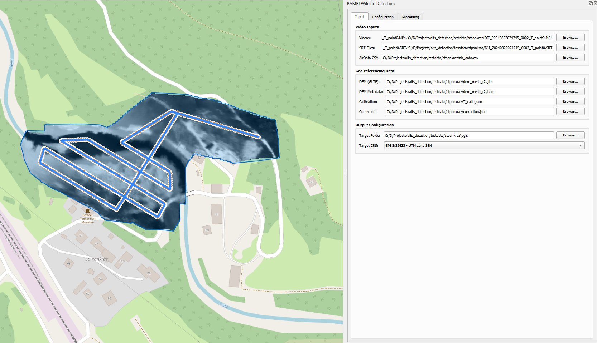

---

## Table of Contents

- [Features](#features)
- [Screenshots](#screenshots)
- [Requirements](#requirements)
- [Installation](#installation)
- [Usage](#usage)
- [Processing Pipeline](#processing-pipeline)
- [Configuration](#configuration)
- [Input File Formats](#input-file-formats)
- [Troubleshooting](#troubleshooting)
- [License](#license)
- [Credits](#credits)

---

## Features

- **Frame Extraction**: Extract frames from drone videos
- **Flight Route Visualization**: Generate and display the drone flight path as a polyline layer
- **Animal Detection**: YOLO-based wildlife detection with automatic model download from HuggingFace
- **Prompt based Segmentations**: Segmentations using Roboflow's SAM3 API
- **Geo-referencing**: Project detections/segmentations onto a Digital Elevation Model (DEM) for real-world coordinates
- **Multi-Object Tracking**: Track animals across frames with multiple backend options
- **Field of View Calculation**: Calculate camera footprints for each frame with custom mask support
- **Orthomosaic Generation**: Create georeferenced orthomosaic from extracted frames
- **GeoTIFF Export**: Export individual frames as georeferenced GeoTIFFs
- **Full QGIS Integration**: Automatically add all outputs as styled layers to QGIS

---
## Requirements

### Data Requirements

- The plugin is intended to be used with DJI Enterprise drones like the DJI M30T, M3T, M4T, M300, ...
- It is recommended to use GPS RTK for recordings
- The plugin needs DJI's SRT logs as well as the flight logs e.g. exported via AirData
- The cameras need to be calibrated and the distortion parameters need to be provided

### System Requirements

- **QGIS**: Version 3.22 or higher
- **Python**: Version 3.9 or higher (included with QGIS)
- **Operating System**: Windows, Linux, or macOS

### Required Python Packages

The plugin requires the **BAMBI Detection Framework** and the **ALFS-PY** framework. Install them using pip within the **OSGeo4W Shell** (Windows) or your QGIS Python environment:

```bash
# Install BAMBI Detection Framework (required)
pip install git+https://github.com/bambi-eco/bambi_detection.git

# Install ALFS-PY Framework (required)
pip install git+https://github.com/bambi-eco/alfs_py.git
```

### Optional: Extended Tracking Capabilities

The plugin includes simple geo-based tracking strategies out of the box. For advanced tracking algorithms, you can optionally install additional packages within the **QGIS OSGeo4W Shell**:

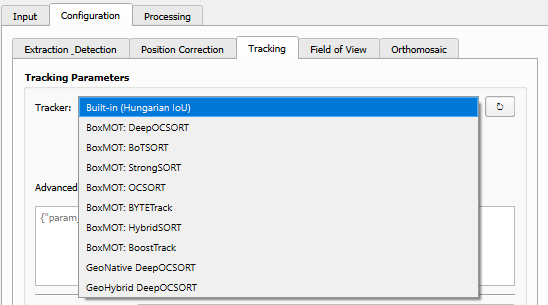

#### BoxMOT Trackers

For state-of-the-art multi-object tracking algorithms (DeepOCSORT, BoTSORT, StrongSORT, ByteTrack, etc.):

```bash
pip install boxmot
```

Or install from source: [https://github.com/mikel-brostrom/boxmot](https://github.com/mikel-brostrom/boxmot)

#### Geo-Referenced Tracking Extension

For tracking algorithms that operate natively in geo-referenced coordinates (recommended for wildlife surveys):

```bash
pip install git+https://github.com/bambi-eco/Geo-Referenced-Tracking.git
```

Or visit: [https://github.com/bambi-eco/Geo-Referenced-Tracking](https://github.com/bambi-eco/Geo-Referenced-Tracking)

---

## Installation

### Method 1: Install from ZIP (Re[dem_mesh_r2.json](../alfs_detection/testdata/haag/dem_mesh_r2.json)commended)

1. Download the repository and zip the "bambi_wildlife_detection" subfolder
2. Open QGIS
3. Go to **Plugins** → **Manage and Install Plugins...**
4. Select the **Install from ZIP** tab
5. Browse to the downloaded ZIP file
6. Click **Install Plugin**

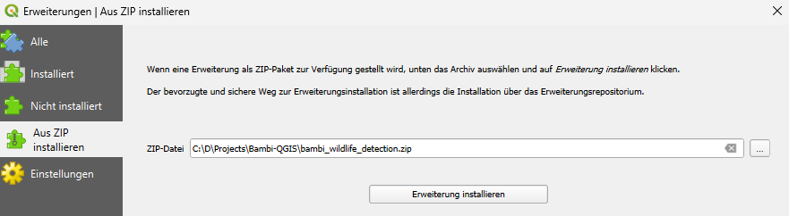

### Method 2: Manual Installation

1. Download and extract the plugin folder
2. Copy the `bambi_wildlife_detection` folder to your QGIS plugins directory:

   | Platform | Path |
   |----------|------|
   | **Windows** | `C:\Users\<username>\AppData\Roaming\QGIS\QGIS3\profiles\default\python\plugins\` |
   | **Linux** | `~/.local/share/QGIS/QGIS3/profiles/default/python/plugins/` |
   | **macOS** | `~/Library/Application Support/QGIS/QGIS3/profiles/default/python/plugins/` |

3. Restart QGIS
4. Enable the plugin via **Plugins** → **Manage and Install Plugins...**

---

## Usage

### Quick Start

1. Click the **BAMBI** icon in the toolbar to open the dock widget
2. Configure inputs in the **Input** tab
3. Adjust parameters in the **Configuration** tab
4. Run processing steps sequentially in the **Processing** tab

### Input Data Requirements

You need the following inputs for a complete processing workflow:

| File Type     | Extension         | Description                                                                                                                                                            |
|---------------|-------------------|------------------------------------------------------------------------------------------------------------------------------------------------------------------------|
| Video Files   | `.MP4`            | Drone thermal video recordings                                                                                                                                         |
| SRT Files     | `.SRT`            | Subtitle files with frame timestamps                                                                                                                                   |
| Calibration   | `.json`           | Camera intrinsic parameters                                                                                                                                            |
| AirData CSV   | `.csv`            | Flight log exported from AirData                                                                                                                                       |
| Correction    | `.json`           | JSON file describing positional corrections (can also be done within plugin)                                                                                           |
| DEM           | `.gltf` or `.glb` | Digital Elevation Model + metadata JSON (either define manually, convert a GeoTIFF DEM or automatically download a suitable DEM (currently only supported for Austria) |
| Target CRS    | `EPSG Code`       | EPSG Code for the target UTM based CRS (e.g. EPSG:32633 for Austria)                                                                                                   |
| Target Folder | `Folder`          | Folder path, where created output should be saved                                                                                                                      |


---

## Configuration

Before starting the actual processes, you can set different individual configurations like sample rates, skip or limit frames, as well as correction factors (required for geo-referencing), as well as many additional settings.

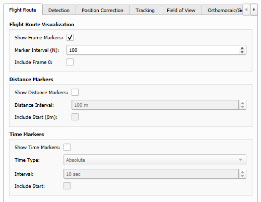

---

## Processing Pipeline

The plugin provides an 10-step processing pipeline. Execute steps in order using the **Processing** tab

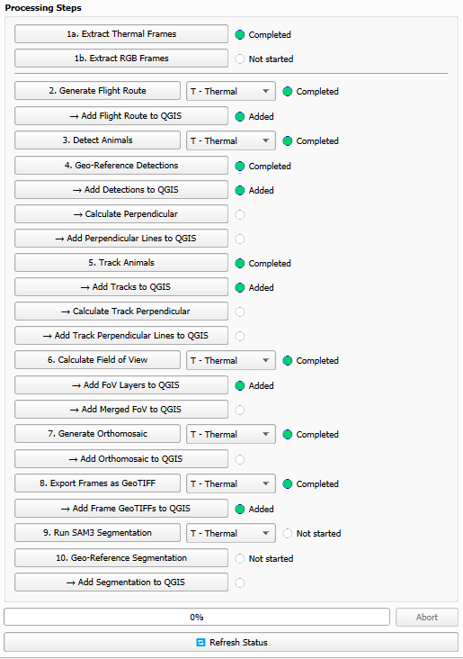

### Step 1: Extract Frames

Extracts and undistorts thermal and/or RGB frames from drone videos.

**Outputs:** `frames_t/` / `frames_w` folder with JPG images and `poses.json`

**Note:** Depending on the length of the input video(s) this process may take some time, and unfortunately the progress bar won't update in between.

### Step 2: Generate Flight Route

Creates a polyline showing the drone's flight path from extracted camera positions.

**Outputs:** `flight_route.geojson` can be added to QGIS as a vector layer

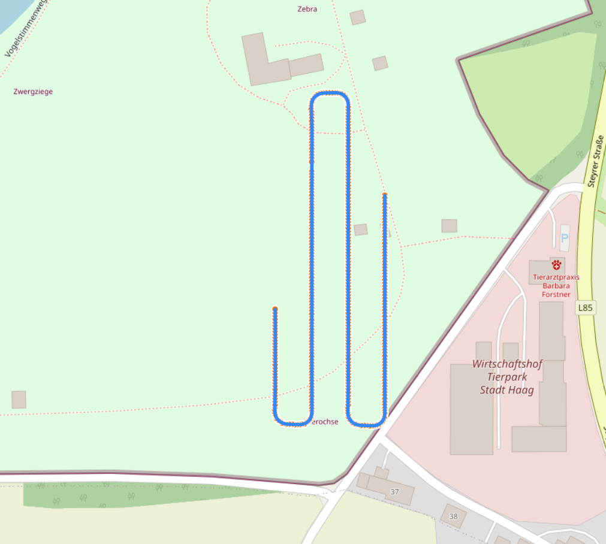

### Step 3: Detect Animals

Runs YOLO-based detection on all extracted frames. The default model is automatically downloaded from HuggingFace.

**Outputs:** `detections/detections.txt`

### Step 4: Geo-Reference Detections

Projects pixel-space detections to real-world coordinates using the DEM.

**Outputs:** `georeferenced/georeferenced.txt` with world coordinates

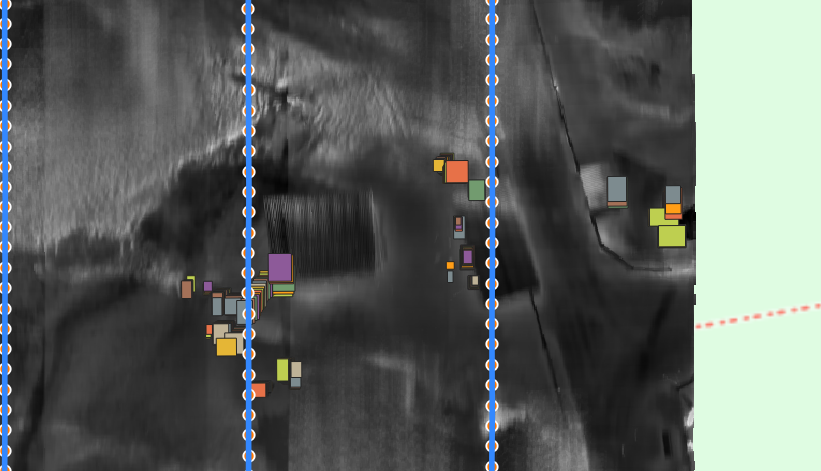

### Step 5: Track Animals

Associates detections across frames into continuous tracks.

**Outputs:** `tracks/tracks.csv` with track IDs and trajectories

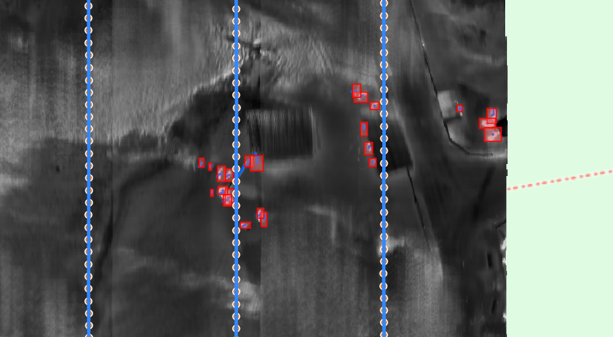

### Step 6: Calculate Field of View

Computes the camera footprint polygon for each frame or for the whole flight.

**Outputs:** `fov/` folder with per-frame and merged FoV polygons

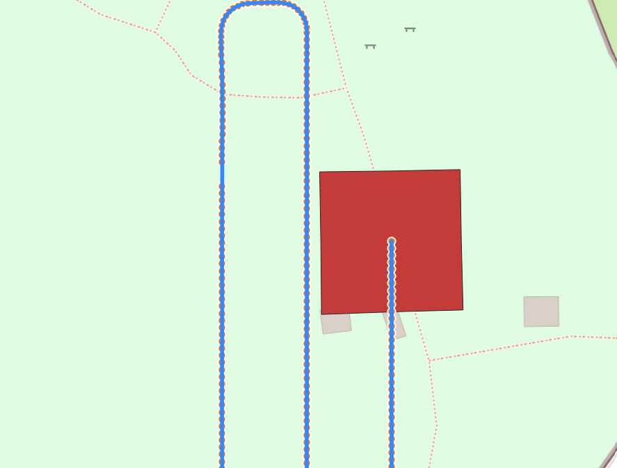

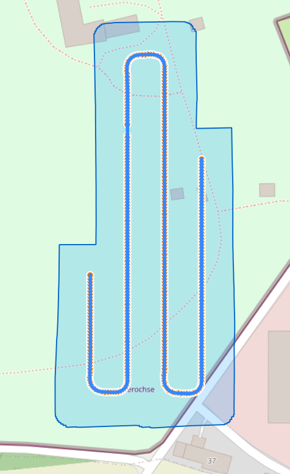


### Step 7: Generate Orthomosaic

Creates a georeferenced orthomosaic by projecting all frames onto the DEM.

**Outputs:** `orthomosaic/orthomosaic.tif` (Cloud-Optimized GeoTIFF)

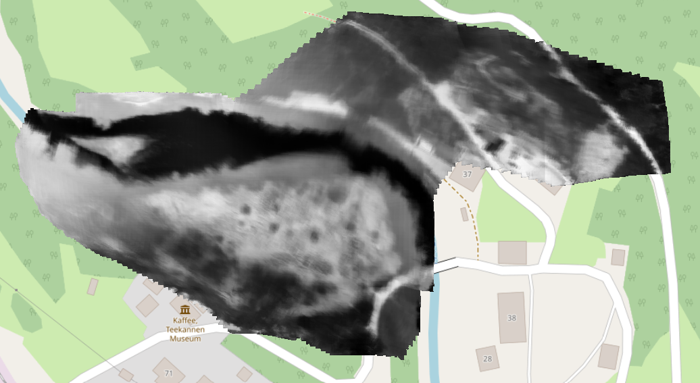

### Step 8: Export Frames as GeoTIFF

Exports individual frames as georeferenced GeoTIFFs for detailed analysis.

**Outputs:** `geotiffs/` folder with per-frame GeoTIFFs

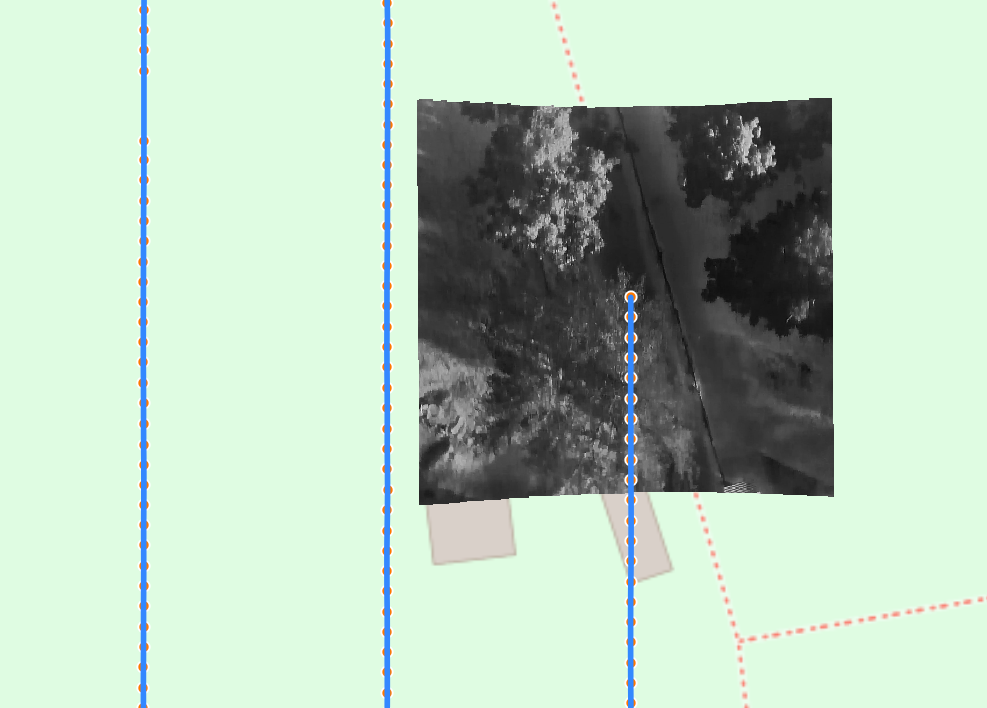

### Step 9: Object Segmentation

Segements individual objects from the aerial images (recommended on RGB only).

**Outputs:** `segmentation/` folder with pixel based segmentations

### Step 10: Geo-Reference Object Segmentation

Geo-Reference segmented objects.

**Outputs:** `segmentation/` folder with coordinate based segmentations.

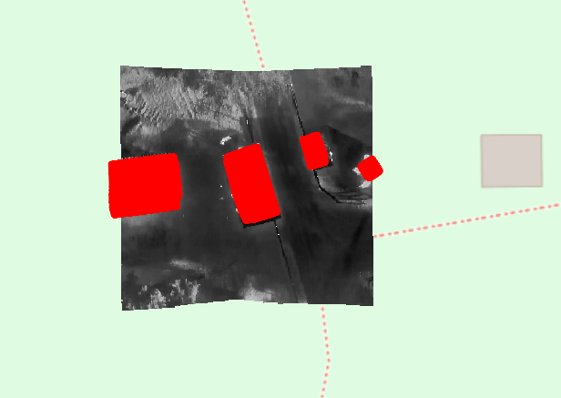

---

## Input File Formats

### Calibration JSON

```json
{
    "mtx": [[fx, 0, cx], [0, fy, cy], [0, 0, 1]],
    "dist": [k1, k2, p1, p2, k3]
}
```

### DEM Metadata JSON

```json
{
    "origin": [UTM_x, UTM_y, UTM_z],
    "origin_wgs84": {
        "latitude": 47.xxx,
        "longitude": 14.xxx,
        "altitude": 500.0
    }
}
```

### Correction JSON (Optional)

```json
{
    "translation": {"x": 0.0, "y": 0.0, "z": 0.0},
    "rotation": {"x": 0.0, "y": 0.0, "z": 0.0}
}
```

---

## Troubleshooting

### Model Download Fails

- Check your internet connection
- Download manually from HuggingFace: [Detection (thermal_animal_detector.pt)](https://huggingface.co/cpraschl/bambi-thermal-detection), [Re-ID (osnet_x0_5_bambi_thermal_omni.pt)](https://huggingface.co/cpraschl/bambi-thermal-omni)
- Place the `.pt` file in `target_folder/models/`

### Geo-referencing Issues

- Ensure the DEM covers your entire flight area
- Verify the DEM metadata JSON has correct origin coordinates
- Check that the target CRS matches your DEM projection

### No Tracks Generated

- Lower the detection confidence threshold
- Adjust the IoU threshold for tracking
- Verify that detections were successfully generated in Step 3

### BoxMOT Import Errors

- Ensure you're installing in the correct Python environment (OSGeo4W Shell)
- Try: `pip install --upgrade boxmot`
- Check for conflicting package versions

### Memory Issues with Large Datasets

- Reduce the number of frames at each processing step, backup the results and repeat the step with different setting
- For creating orthomosaics/geotiffs also:
  - Reduce the orthomosaic resolution
  - Decrease the max tile size parameter

### Problems installing dependencies

If you are installing the dependencies using above's command you have to install Git and add it to the the OSGeo4W Shell's path.
On windows you can e.g. edit the `OSGeo4W.bat` file and include the set command:

```text
@echo off
rem Root OSGEO4W home dir to the same directory this script exists in
call "%~dp0\bin\o4w_env.bat"
set "PATH=C:\Users\<username>\AppData\Local\Programs\Git\cmd\;%PATH%"

rem List available o4w programs
rem but only if osgeo4w called without parameters
@echo on
@if [%1]==[] (echo run o-help for a list of available commands & cd /d "%~dp0" & cmd.exe /k) else (cmd /c "%*")
```

Alternatively, you can download both repositories and unzip them.
Using pip you can install them directly, using the projects' paths.

```shell
pip install <path>/alfs_py
pip install <path>/alfs_detection
```

---

## Output Structure

When running all processes the target folder will look something like:

```
target_folder/
├── frames_t/                               # Extracted thermal video frames
│   ├── frame_000000.jpg      
│   ├── frame_000010.jpg      
│   └── ...      
├── frames_w/                               # Extracted RGB video frames
│   ├── frame_000000.jpg      
│   ├── frame_000010.jpg      
│   └── ...      
├── poses_t.json                            # Camera poses for each thermal frame
├── poses_w.json                            # Camera poses for each RGB frame
├── mask_T.png                              # Thermal mask file (depending on camera during extraction phase)
├── mask_W.png                              # RGB mask file (depending on camera during extraction phase)
├── flight_route                    
│   └── flight_route.geojson                # Drone flight path
├── detections/             
│   └── detections.txt                      # Raw YOLO detections
├── georeferenced/      
│   └── georeferenced.txt                   # Geo-referenced detections
├── tracks/      
│   └── tracks.csv                          # Animal tracks with IDs
├── fov/      
│   ├── fov_polygons.geojson                # Per-frame FoV polygons
│   └── merged_fov.geojson                  # Combined coverage area
├── orthomosaic/      
│   └── orthomosaic.tif                     # Georeferenced mosaic
├── geotiffs/      
│   ├── frame_000000.tiff                   # Per-frame GeoTIFFs
│   └── ...      
├── segmentation/      
│   ├── segmentation_pixel.json             # pixel based segmentation masks
│   └── segmentation_georef.json            # geo-referenced segmentation masks
└── models/ 
    └── thermal_animal_detector.pt          # Bambi detection model
    └── osnet_x0_5_bambi_thermal_omni.pt    # Bambi Re-ID model
    └── osnet_x0_25_msmt17.pt               # BoxMOT defaul Re-ID model
```

---
## Citation

If you use this plugin in your research, please cite:

```bibtex
@Article{praschlGeoReferencedTracking,
    author  = {Praschl, Christoph and Coucke, Vincent and Maschek, Anna and Schedl, David},
    title   = {Stay Local or Go Global: Geo-Referenced Bounding Boxes for
               Tracking Wildlife in Thermal Drone Videos},
}
```
---

## License

This plugin is released under the **MIT License**.

See [LICENSE](LICENSE) for details.

---

## Credits

**Author:** Christoph Praschl, Anna Maschek, David C. Schedl  
**Organization:** University of Applied Sciences Upper Austria, Hagenberg Campus  

### Dependencies

- [ALFS-PY Framework](https://github.com/bambi-eco/alfs_py)
- [BAMBI Detection Framework](https://github.com/bambi-eco/bambi_detection)
- [Ultralytics YOLO](https://github.com/ultralytics/ultralytics)
- [BoxMOT](https://github.com/mikel-brostrom/boxmot) (optional)
- [Geo-Referenced Tracking](https://github.com/bambi-eco/Geo-Referenced-Tracking) (optional)

---

## Contributing

Contributions are welcome! Please feel free to submit issues or pull requests.


