# BAMBI QGIS Plugin

[](https://qgis.org)
[](https://opensource.org/license/mit)
[](https://www.python.org/)

A comprehensive QGIS plugin for detecting and tracking wildlife in aerial drone recordings — supporting both **video** and **still photo** workflows — with full geo-referencing, flight route visualization, and perpendicular distance sampling.

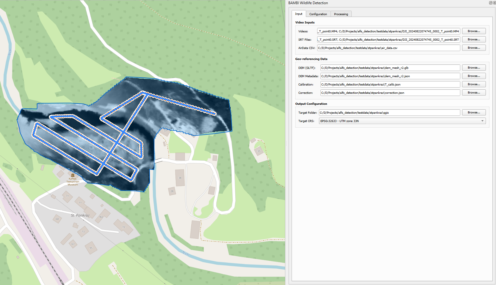

---

## Table of Contents

- [Features](#features)
- [Requirements](#requirements)
- [Installation](#installation)
- [Dependency Manager](#dependency-manager)
- [Usage](#usage)
- [Processing Pipeline](#processing-pipeline)
- [Configuration](#configuration)
  - [Extraction Configuration](#extraction-configuration)
- [Interactive Selection Tools](#interactive-selection-tools)
- [Correction Calibration Wizard](#correction-calibration-wizard)
- [Camera Calibration Wizard](#camera-calibration-wizard)
- [Thermal Image Viewer](#thermal-image-viewer)
- [Random Flight Strategy Planner](#random-flight-strategy-planner)
- [Input File Formats](#input-file-formats)
- [Output Structure](#output-structure)
- [Troubleshooting](#troubleshooting)
- [Screenshots](#screenshots)
- [License](#license)
- [Credits](#credits)

---

## Features

- **Dual Input Mode**: Process drone **videos** (with SRT timestamps) or **still photo collections** from a single mission
- **Frame Extraction**: Extract and undistort thermal and RGB frames; camera calibration applied automatically
- **Flight Route Visualization**: Generate the drone's GPS flight path from the AirData log as a vector line layer, plus per-frame camera position markers
- **Animal Detection**: YOLO-based wildlife detection with automatic model download from HuggingFace
- **Prompt-based Segmentation**: Object segmentation using Roboflow's SAM3 API
- **Geo-referencing**: Project detections and segmentations onto a Digital Elevation Model (DEM) for real-world UTM coordinates
- **Perpendicular Distance Sampling**: For each geo-referenced detection (or the last bounding box of each track), automatically find the nearest point on the flight route and measure the perpendicular distance
- **Multi-Object Tracking**: Track animals across frames with multiple backend options (built-in, BoxMOT, Geo-Referenced Tracking)
- **Field of View Calculation**: Calculate camera footprints for each frame with optional custom mask support
- **Orthomosaic Generation**: Create georeferenced orthomosaics by projecting all frames onto the DEM
- **GeoTIFF Export**: Export individual frames as georeferenced GeoTIFFs for detailed analysis
- **DEM Import**: Automatically download DEMs (currently limited to Austria), or convert any GeoTIFF DEM to the required GLB format — including source CRS override for files with incorrect embedded CRS metadata
- **Full QGIS Integration**: All outputs are automatically added as styled layers to the QGIS layer panel
- **Interactive Selection Tools**: Click directly on the QGIS map canvas to inspect detection/track bounding boxes or individual field-of-view polygons; the tools warn when the required layers are not loaded
- **Correction Calibration Wizard**: Three-step guided workflow for finding and storing per-flight or per-frame-range positional and rotational correction factors, including automatic z-offset probing, yaw alignment, a circle-intersection visualizer, and a light-field preview
- **Camera Calibration Wizard**: Guided two-mode calibration tool for estimating camera intrinsic parameters — Structure-from-Motion (SfM) for single cameras and manual point-correspondence + Nelder-Mead optimisation for stereo RGB + thermal setups; accepts images or video, and exports industry-standard calibration JSON files
- **Thermal Image Viewer**: Standalone radiometric viewer for DJI thermal images; supports multiple colormaps and adjustable temperature thresholds — requires the DJI Thermal SDK
- **Random Flight Strategy Planner**: Generate randomized transect-based drone survey routes from a monitoring-area polygon, optional exclusion zones, and candidate start points; results (grid, transects, and numbered routes) are imported directly as styled QGIS layers
- **Dependency Manager**: Install and update all optional and required Python packages from within QGIS — no OSGeo4W Shell required
- **Frame Extraction Configuration**: Fine-grained control over frame extraction via the Configuration → Extraction tab: skip leading frames, cap the total frame count, set a per-frame sampling rate (video only), and configure thermal image colormap and temperature thresholds (requires DJI Thermal SDK)

---

## Requirements

### Data Requirements

- The plugin is designed for DJI Enterprise drones (M30T, M3T, M4T, M300, etc.) with thermal and/or RGB cameras
- GPS RTK recordings are recommended for best geo-referencing accuracy
- **Video mode**: Requires SRT subtitle files (frame timestamps) and an AirData flight log CSV
- **Photo mode**: Requires a directory of still images and an AirData flight log CSV for GPS positions; SRT files are not needed
- Camera calibration (intrinsic parameters) must be provided for lens undistortion

### System Requirements

- **QGIS**: Version 3.22 or higher
- **Python**: Version 3.9 or higher (included with QGIS)
- **Operating System**: Windows, Linux, or macOS

### Required Python Packages

The plugin requires the **BAMBI Detection Framework** and the **ALFS-PY** framework.

The easiest way to install them is via the built-in **Dependency Manager** (see [Dependency Manager](#dependency-manager)). Alternatively, use pip within the **OSGeo4W Shell** (Windows) or your QGIS Python environment:

```bash
# Install BAMBI Detection Framework (required)
pip install git+https://github.com/bambi-eco/bambi_detection.git

# Install ALFS-PY Framework (required)
pip install git+https://github.com/bambi-eco/alfs_py.git
```

**Note**: After installing new Python packages you must restart QGIS. QGIS loads its Python environment only at startup and will not detect new packages dynamically.

### Optional: Flight Route Generation

To use the Random Flight Strategy Planner, install the following packages (or use the Dependency Manager):

```bash
pip install fiona==1.10.1
pip install simplekml==1.3.6
```

### Optional: Single Camera Calibration

When you want to calibrate a single camera setup (e.g. a drone only with a RGB camera), we need to apply a structure-from-motion process to estimate the camera's intrinsics.

To do so we use pycolmap, which has to be installed.

```
pip install pycolmap==4.0.3
```

**Note**: This is not required for the stereo (thermal + rgb) calibration!

### Optional: AI GPU Support

Per default the inference of the AI models is CPU bound. If you want to run e.g. the detection on your GPU you have to re-install PyTorch with bindings suitable for your GPU.
E.g. for Nvidia Cuda 12.1+ use the following dependencies (use nvidia-smi to check for compatible Cuda versions):

```
pip uninstall torch torchvision -y
pip install torch torchvision --index-url https://download.pytorch.org/whl/cu121
```

> Tested with torch 2.5.1+cu121 and torchvision 0.20.1+cu121


### Optional: Extended Tracking Capabilities

The plugin includes simple geo-based tracking strategies out of the box. For advanced tracking algorithms, install the following packages in the **QGIS OSGeo4W Shell**:

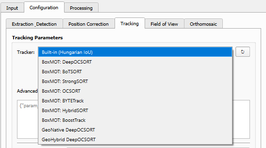

#### BoxMOT Trackers

For state-of-the-art multi-object tracking algorithms (DeepOCSORT, BoTSORT, StrongSORT, ByteTrack, etc.):

```bash
pip install boxmot==17.0.0
```

Or install from source: [https://github.com/mikel-brostrom/boxmot](https://github.com/mikel-brostrom/boxmot)

#### Geo-Referenced Tracking Extension

For tracking algorithms that operate natively in geo-referenced coordinates (recommended for wildlife surveys; builds upon BoxMOT so both dependencies are required):

```bash
pip install git+https://github.com/bambi-eco/Geo-Referenced-Tracking.git
```

Or visit: [https://github.com/bambi-eco/Geo-Referenced-Tracking](https://github.com/bambi-eco/Geo-Referenced-Tracking)

#### Thermal Image Viewer

The plugin supports a radiometric thermal image viewer. However, this uses [DJI's Thermal SDK](https://www.dji.com/at/downloads/softwares/dji-thermal-sdk), which has to be manually added after the installation of the plugin by unzipping it to:
```shell
C:\Users\<YourUserName>\AppData\Roaming\QGIS\QGIS3\profiles\default\python\plugins\bambi_wildlife_detection\plugins\<dji_thermal_sdk_v*>
```

The **Dependency Manager** provides a one-click download button for the DJI Thermal SDK ZIP that extracts it to the correct location automatically.

---

## Installation

### Method 1: Install from ZIP (Recommended)

1. Download the plugin by either
    - Getting the zipped plugin from a [released version](https://github.com/bambi-eco/Bambi-QGIS/releases) (recommended)
    - Or downloading this repository and zipping the `bambi_wildlife_detection` subfolder for the current development version
2. Open QGIS
3. Go to **Plugins** → **Manage and Install Plugins...**
4. Select the **Install from ZIP** tab
5. Browse to the downloaded ZIP file
6. Click **Install Plugin**

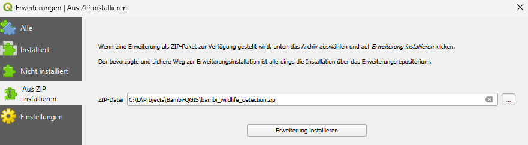

### Method 2: Manual Installation

1. Download and extract the plugin folder
2. Copy the `bambi_wildlife_detection` folder to your QGIS plugins directory:

   | Platform | Path |
   |----------|------|
   | **Windows** | `C:\Users\<username>\AppData\Roaming\QGIS\QGIS3\profiles\default\python\plugins\` |
   | **Linux** | `~/.local/share/QGIS/QGIS3/profiles/default/python/plugins/` |
   | **macOS** | `~/Library/Application Support/QGIS/QGIS3/profiles/default/python/plugins/` |

3. Restart QGIS
4. Enable the plugin via **Plugins** → **Manage and Install Plugins...**

---

## Dependency Manager

The Dependency Manager lets you install and update all BAMBI plugin dependencies directly from within QGIS — no terminal or OSGeo4W Shell required. Open it via the **Dependency Manager** toolbar button or the **Plugins → Bambi - QGIS Integration → Dependency Manager** menu entry.

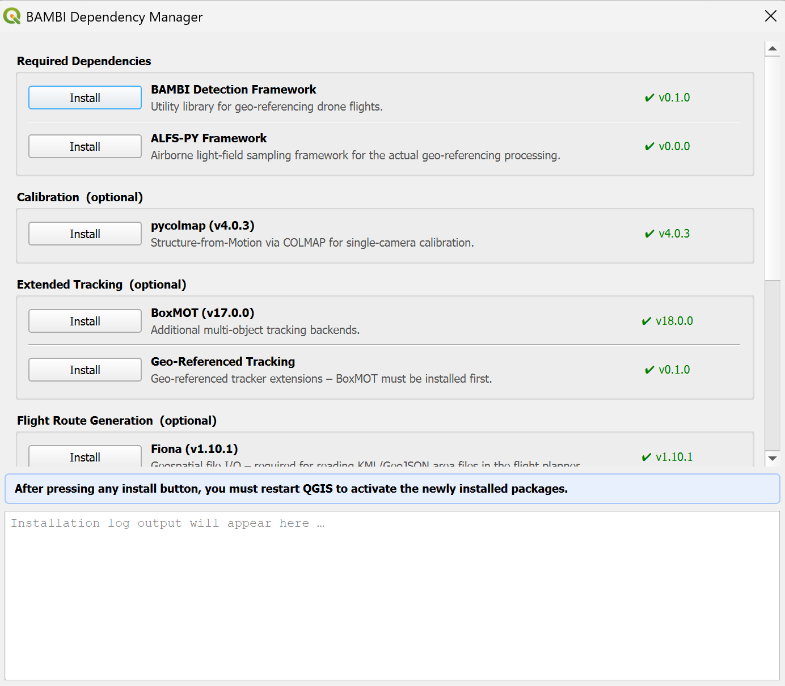

Each dependency group shows the currently installed version (green ✔, orange ⚠ for untested, or grey "not found") and an Install button that runs pip in a background thread, streaming the output to the log area at the bottom of the dialog.

| Group | Packages |
|-------|----------|
| **Required Dependencies** | BAMBI Detection Framework, ALFS-PY Framework |
| **Calibration (optional)** | pycolmap |
| **Extended Tracking (optional)** | BoxMOT, Geo-Referenced Tracking |
| **Flight Route Generation (optional)** | Fiona, simplekml |
| **DJI Thermal SDK** | Download & extract to the correct plugin subfolder |
| **GPU Support – CUDA** | torch + torchvision (CUDA 12.1 builds) |

> **Note**: After any installation you must restart QGIS to activate the newly installed packages.

---

## Usage

### Quick Start

1. Click the **BAMBI** icon in the toolbar to open the dock widget
2. Select your **input mode** (Video or Photo) in the **Input** tab
3. Configure inputs and the target folder
4. Adjust parameters in the **Configuration** tab
5. Run processing steps sequentially in the **Processing** tab

### Input Modes

#### Video Mode

Used when the drone recorded continuous video (thermal and/or RGB). Each camera requires:

| File Type   | Extension | Description                              |
|-------------|-----------|------------------------------------------|
| Video files | `.MP4`    | Drone thermal and/or RGB video recordings |
| SRT files   | `.SRT`    | Subtitle files with per-frame timestamps |
| Calibration | `.json`   | Camera intrinsic parameters              |

#### Photo Mode

Used when the drone captured a series of still images (e.g. single-shot mapping flights). Each camera requires:

| File Type        | Extension | Description                               |
|------------------|-----------|-------------------------------------------|
| Photo directory  | folder    | Directory containing the still images     |
| Calibration      | `.json`   | Camera intrinsic parameters               |

In photo mode, GPS positions are matched to images via timestamps in the AirData log and the image EXIF data. SRT files are not required.

### Common Inputs (Both Modes)

| File Type     | Extension         | Description                                                                                                                                                             |
|---------------|-------------------|-------------------------------------------------------------------------------------------------------------------------------------------------------------------------|
| AirData CSV   | `.csv`            | Flight log exported from AirData (GPS positions, altitude, timestamps)                                                                                                  |
| Calibration   | `.json`           | Camera intrinsic parameters for undistortion                                                                                                                            |
| Correction    | `.json`           | JSON file with positional/rotational corrections (can also be adjusted interactively in the plugin)                                                                     |
| DEM           | `.gltf` or `.glb` | Digital Elevation Model + metadata JSON. Either provide manually, convert a GeoTIFF, or download automatically (Austria only)                                           |
| Target CRS    | EPSG code         | UTM-based CRS for the output (e.g. `EPSG:32633` for UTM Zone 33N)                                                                                                      |
| Target Folder | folder path       | Output directory for all generated files                                                                                                                                |

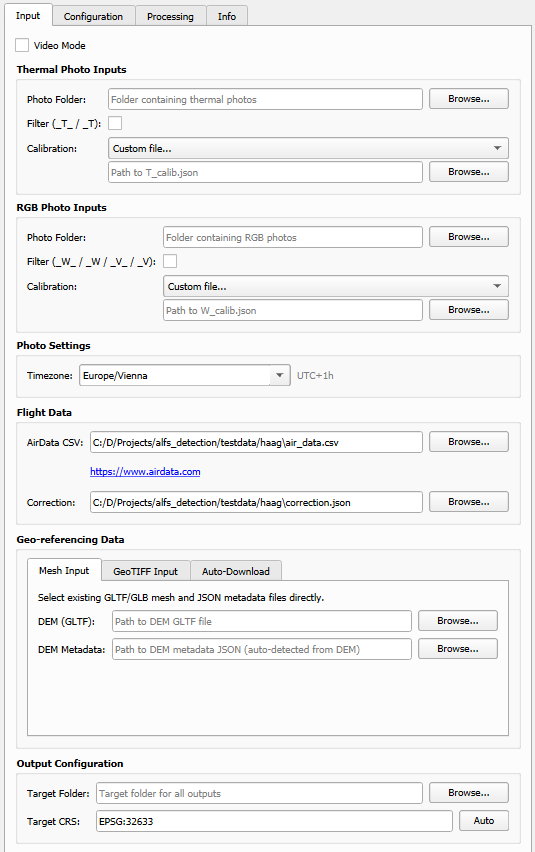

---

## Configuration

Before starting processing, configure per-step settings in the **Configuration** tab:

- **Extraction**: Frame skip, limit, sampling rate, and thermal visualisation (see below)
- **Detection**: Confidence threshold, model path
- **Tracking**: Backend selection, IoU threshold, interpolation
- **Orthomosaic**: Resolution, tile size
- **Correction factors**: Translation and rotation offsets for geo-referencing
- **Flight route**: Frame marker interval, distance marker interval
- **Field of View**: Custom mask, simplification

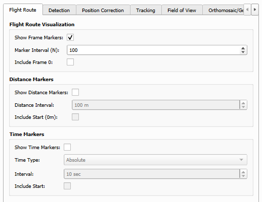

---

### Extraction Configuration

The **Extraction** sub-tab (Configuration → Extraction) provides fine-grained control over which frames are processed and how thermal images are rendered.

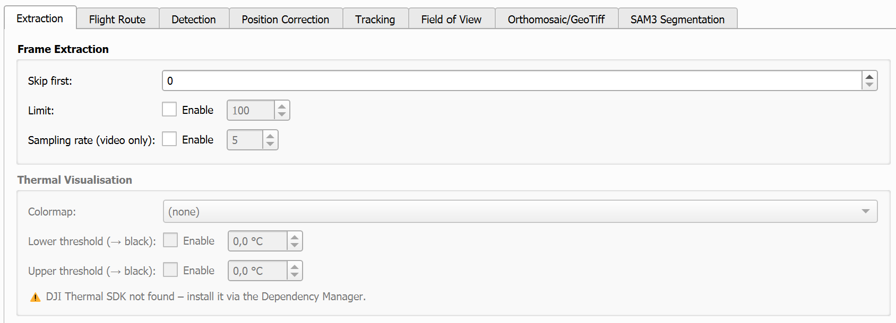

#### Frame Extraction

| Setting | Description |
|---------|-------------|
| **Skip first** | Skip this many frames/images at the start before processing begins. Useful for ignoring take-off frames. |
| **Limit** | Cap the total number of frames processed (enable the checkbox to activate). |
| **Sampling rate** *(video only)* | Take every N-th frame (e.g. 5 = every 5th frame). Reduces processing time for long recordings. |

#### Thermal Visualisation

> **Requires DJI Thermal SDK.** Install it via the [Dependency Manager](#dependency-manager). The entire group is disabled and greyed out when the SDK is not detected.

| Setting | Description |
|---------|-------------|
| **Colormap** | Apply a false-colour map to the exported thermal frames (e.g. `plasma`, `inferno`, `jet`, `white-hotspot`). Choose `(none)` to keep raw 8-bit grey values. |
| **Lower threshold** | Pixels below this temperature (°C) are rendered black. Enable the checkbox to activate. |
| **Upper threshold** | Pixels above this temperature (°C) are rendered black. Enable the checkbox to activate. |

---

## Processing Pipeline

The plugin provides a sequential processing pipeline. Execute steps in order using the **Processing** tab.

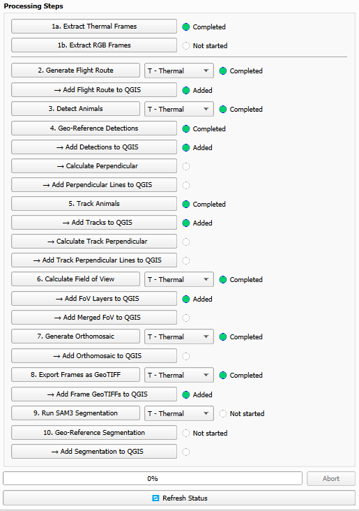

---

### Step 1: Extract Frames

Extracts, undistorts, and geo-tags frames from the input data.

- **Video mode**: Decodes frames from thermal/RGB video files; timestamps from SRT logs are matched with AirData GPS positions to compute camera poses
- **Photo mode**: Reads still images from the specified directories; image timestamps (EXIF) are matched with AirData GPS positions to compute camera poses

**Outputs:**
```
frames_t/          # Undistorted thermal frames
frames_w/          # Undistorted RGB frames
poses_t.json       # Camera pose for every thermal frame
poses_w.json       # Camera pose for every RGB frame
mask_T.png         # Undistortion mask (thermal)
mask_W.png         # Undistortion mask (RGB)
```

> **Note:** For large datasets or long videos this step may take several minutes. Progress is updated between frames.

---

### Step 2: Generate Flight Route

Builds two complementary vector layers from the mission data:

- **Flight route line**: GPS positions recorded in the AirData CSV are projected to the target UTM CRS and connected as a `LineString`. This represents the true GPS-recorded flight path.
- **Camera position points**: The position of the drone at every extracted frame (from `poses.json`) is added as a separate point layer — these are the positions at which images were actually captured.

**Outputs:**
```
flight_route/
├── flight_route.geojson       # GPS-based flight path (LineString)
└── camera_positions.geojson   # Per-frame camera positions (Points)
```

Use **→ Add Flight Route to QGIS** to load both layers with styling applied.

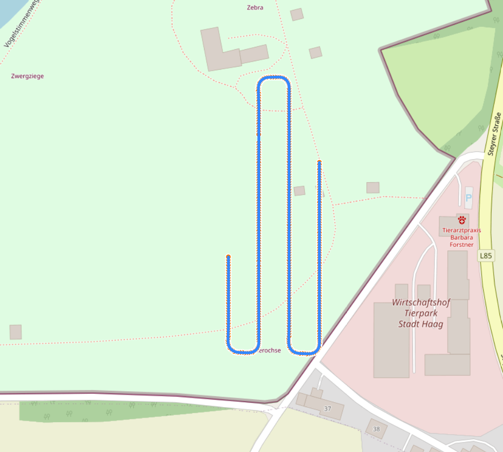

---

### Step 3: Detect Animals

Runs YOLO-based detection on all extracted frames. The default thermal wildlife detection model is downloaded automatically from HuggingFace on first use.

**Outputs:**
```
detections/
└── detections.txt    # Bounding box detections (frame, x1, y1, x2, y2, confidence, class)
```

---

### Step 4: Geo-Reference Detections

Projects pixel-space bounding boxes to real-world UTM coordinates by ray-casting against the DEM mesh. Each detection's four corners are projected and the result is stored as a world-space bounding box.

**Outputs:**
```
georeferenced/
└── georeferenced.txt    # Detections with UTM bounding box coordinates
```

Use **→ Add Detections to QGIS** to load per-frame detection layers.

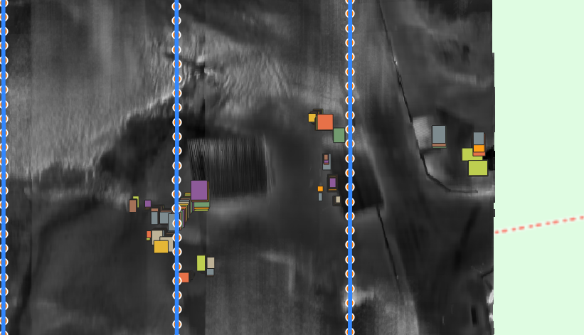

---

### → Calculate Perpendicular (Detection Distances)

For each geo-referenced detection, computes the **perpendicular distance** to the flight route:

1. The 2D center of each detection's bounding box is computed
2. The nearest point on the AirData GPS `LineString` is found by projecting onto each segment
3. The Euclidean distance between the detection center and the foot point is recorded

This is particularly useful for **transect-based wildlife surveys**, where the perpendicular offset from the flight line is a key sampling variable.

**Outputs:**
```
flight_route/
├── perpendicular.json             # Flat list (used by QGIS layer)
└── perpendicular_by_image.json    # Per-image keyed results
```

`perpendicular_by_image.json` structure:
```json
{
  "frame_000042.jpg": {
    "0": {
      "center": [UTM_x, UTM_y, altitude],
      "perpendicular": [foot_x, foot_y, altitude],
      "distance": 12.34
    }
  }
}
```

Use **→ Add Perpendicular Lines to QGIS** to visualize the connections as line features with `distance_m` attribute.


---

### Step 5: Track Animals

Associates detections across frames into continuous tracks using the selected tracking backend.

- Tracks with a single detection (no movement) are fully supported and appear as a bounding box without a movement line
- Multi-detection tracks show both the movement path and the final bounding box

**Outputs:**
```
tracks/
├── tracks_pixel.csv    # Tracks in pixel coordinates
└── tracks.csv          # Geo-referenced tracks (UTM)
```

Use **→ Add Tracks to QGIS** to load each track as a grouped layer (movement path + final bounding box).

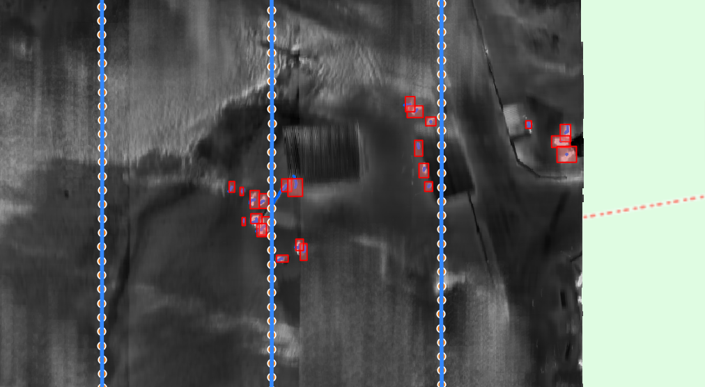

---

### → Calculate Track Perpendicular (Track Distances)

For each track, takes the **last bounding box** (the animal's final recorded position) and calculates the perpendicular distance to the flight route, using the same method as the detection perpendicular step.

**Outputs:**
```
flight_route/
├── perpendicular_tracks.json             # Flat list (used by QGIS layer)
└── perpendicular_tracks_by_track.json    # Per-track keyed results
```

`perpendicular_tracks_by_track.json` structure:
```json
{
  "42": {
    "last_frame": 123,
    "last_image": "frame_000123.jpg",
    "center": [UTM_x, UTM_y, altitude],
    "perpendicular": [foot_x, foot_y, altitude],
    "distance": 35.7
  }
}
```

Use **→ Add Track Perpendicular Lines to QGIS** to visualize as line features.


---

### Step 6: Calculate Field of View

Computes the camera footprint polygon on the ground for each frame (or a subset), using the DEM for accurate terrain-following projection.

**Outputs:**
```
fov/
├── fov_polygons.txt      # Per-frame FoV polygon coordinates
└── merged_fov.geojson    # Union of all footprints (coverage area)
```

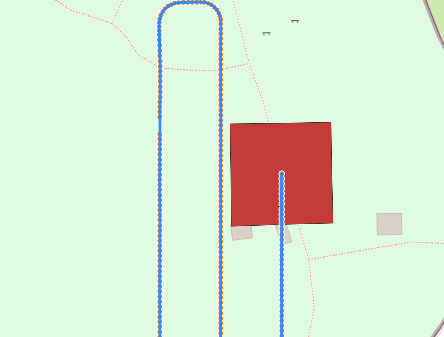

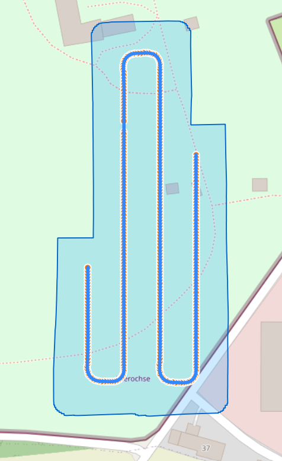

---

### Step 7: Generate Orthomosaic

Creates a georeferenced orthomosaic by projecting all (or a subset of) frames onto the DEM surface and blending them together. Output is a Cloud-Optimized GeoTIFF.

**Outputs:**
```
orthomosaic/
└── orthomosaic.tif    # Georeferenced mosaic (COG GeoTIFF)
```

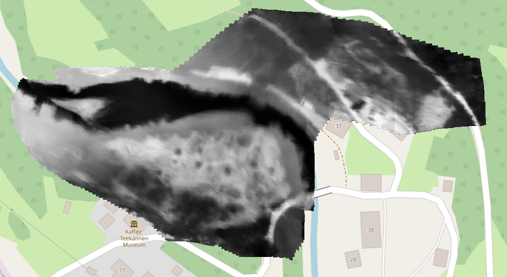

---

### Step 8: Export Frames as GeoTIFF

Exports individual frames as georeferenced GeoTIFFs, suitable for import into GIS tools or for detailed per-frame analysis.

**Outputs:**
```
geotiffs/
├── frame_000000.tiff
└── ...
```

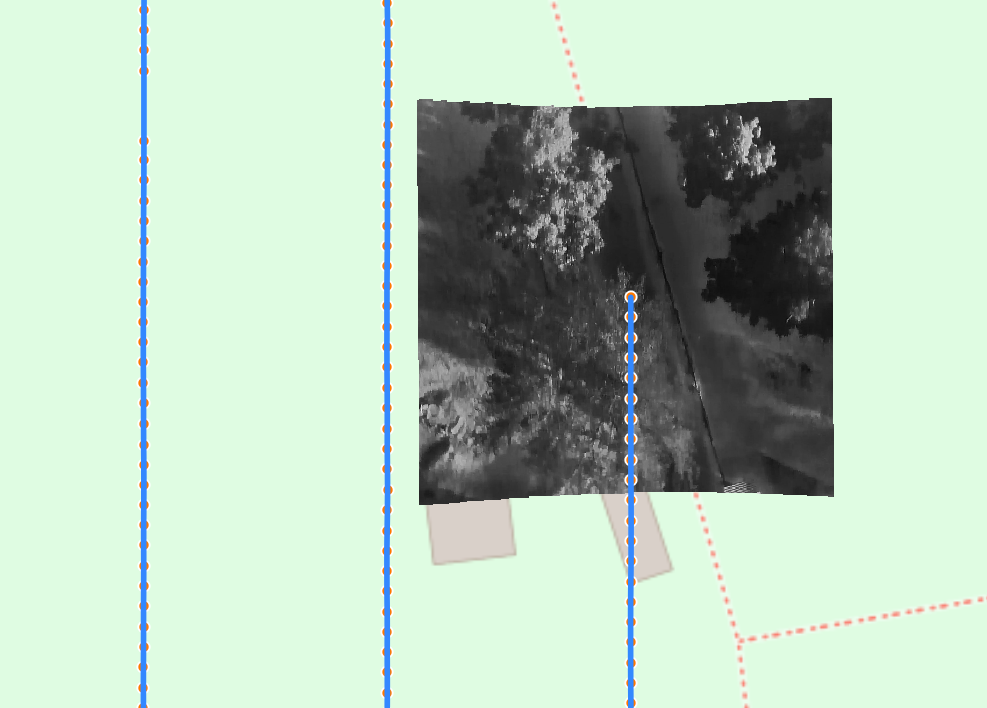

---

### Step 9: Object Segmentation

Segments individual detected objects from aerial images using Roboflow's SAM3 API. Recommended for RGB imagery.

**Outputs:**
```
segmentation/
└── segmentation_pixel.json    # Pixel-space segmentation masks
```

---

### Step 10: Geo-Reference Object Segmentation

Projects SAM3 pixel-space segmentation masks to world coordinates using the DEM.

**Outputs:**
```
segmentation/
└── segmentation_georef.json    # UTM-coordinate segmentation polygons
```

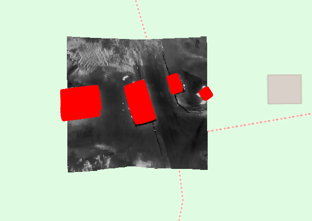

---

## DEM Import and Conversion

The plugin supports three ways to provide a DEM:

### 1. Automatic Download (Austria only)

Use the **DEM** tab to download and tile Austrian elevation data from the BEV ATOM service automatically.

### 2. Convert a GeoTIFF DEM

Any GeoTIFF DEM can be converted to the required GLB + metadata JSON format using the **GeoTIFF Input** panel in the DEM tab:

- **Input file**: Path to the GeoTIFF (`.tif` / `.tiff`)
- **Output folder**: Where the `.glb` and `.json` files will be saved
- **Output CRS**: Target UTM CRS for the mesh (e.g. `EPSG:32633`)
- **Simplification**: Mesh vertex reduction factor (1 = full resolution)
- **Source CRS** *(optional)*: Override the CRS embedded in the file. Use this when the GeoTIFF has incorrect CRS metadata — for example, a file containing SWEREF99TM (EPSG:3006) data but tagged as EPSG:32634. Leave empty to auto-detect.


### 3. Manual DEM

Provide a `.gltf` or `.glb` file and its companion `.json` metadata file directly.

---

## Interactive Selection Tools

Three map-canvas click tools are available from the BAMBI toolbar to inspect layers that have already been loaded into QGIS.
Additionally, we provide the correction wizard allowing to estimate positional/rotational offsets and a calibration wizard for determining camera intrinsics for undistortion.

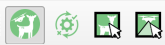


### Detection / Track Selection

Click the **Select Detection or Track** tool in the toolbar, then click anywhere on the map canvas to highlight the detection or track bounding box nearest to the clicked point.

- Works on any layer that was added via **→ Add Detections to QGIS** or **→ Add Tracks to QGIS**
- The clicked feature is selected in the layer and its attributes are shown in the inspector panel
- If no detection or track layers are present in the QGIS layer hierarchy, a warning dialog is shown:
  > *"No active detection or track layers were found in the layer hierarchy. Please add/activate individual detection or track layers to QGIS before using this tool."*

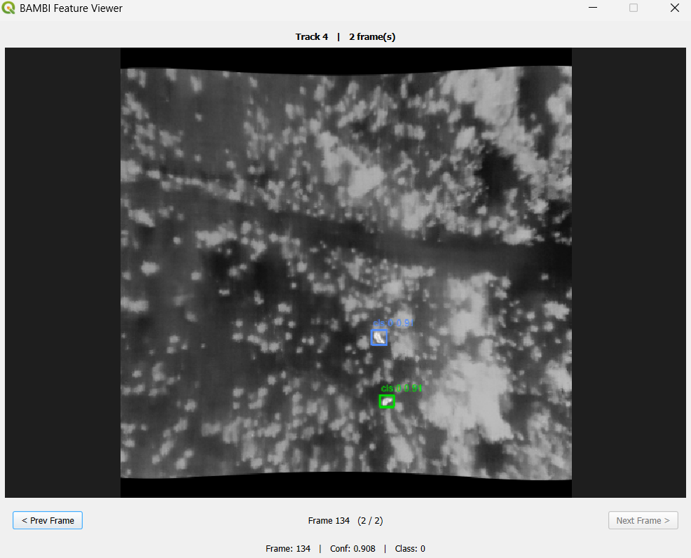

### Field-of-View Selection

Click the **Select Field of View** tool in the toolbar, then click on the canvas to select the FoV(s) that contains the clicked point.

- Works on any layer that was added via **→ Add Field of View to QGIS** (not the merged FoV!)
- If no Field of View layers are present, a warning dialog is shown:
  > *"No Field of View layers were found in the layer hierarchy. Please add individual Field of View layers to QGIS before using this tool."*

> Note: There are two versions of the FoV tool. One fast version for just opening the related FoVs and one version that also geo-references your click and shows the geo-referenced click using a yellow cross. This requires loading the digital elevation model, which takes some time. Additionally, the result is highly dependent on your calibration parameters as well as your correction factors!

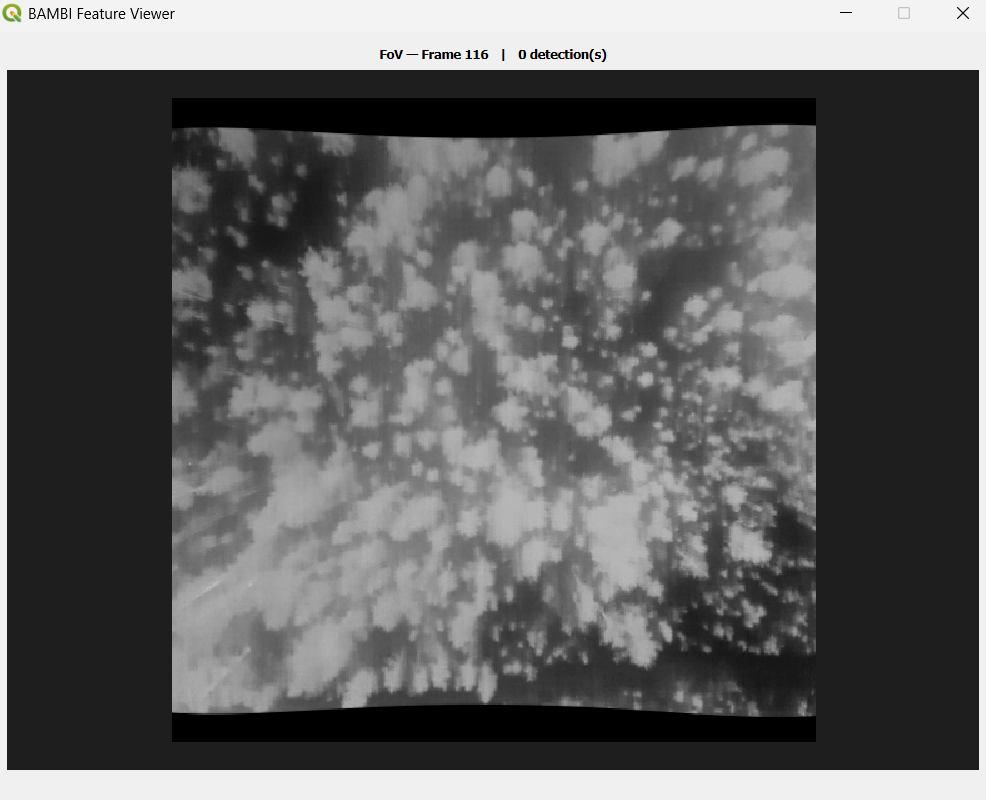

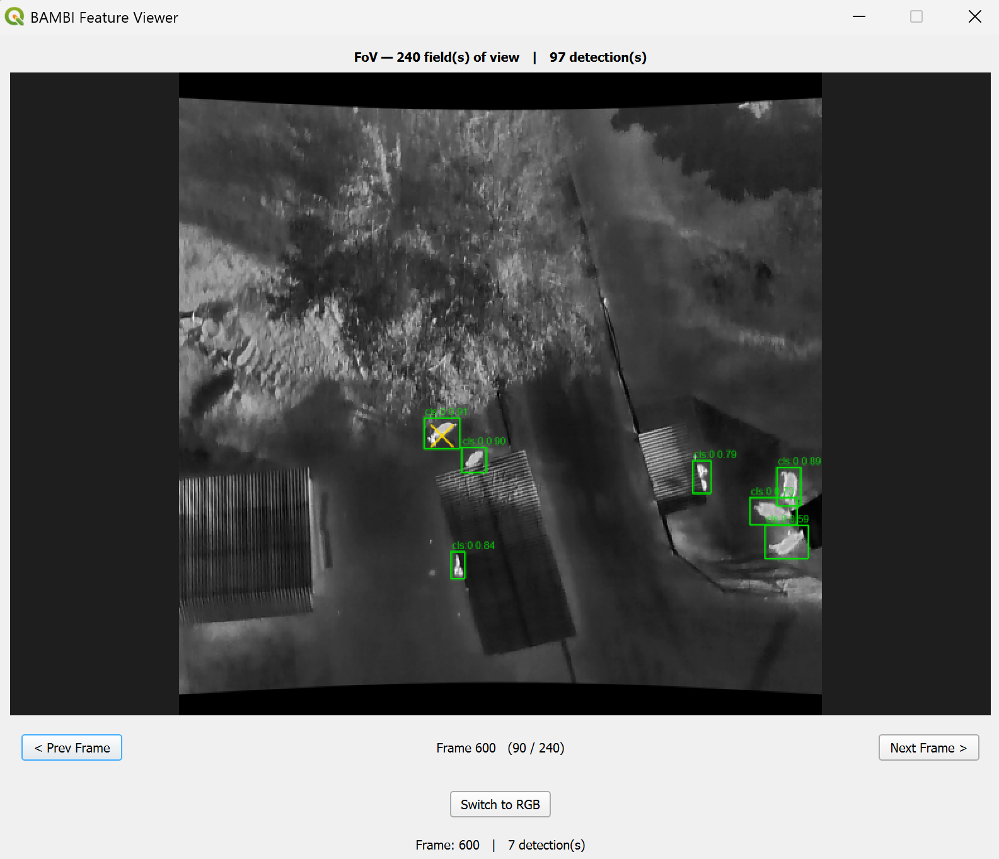

### Correction Calibration Wizard

The Correction Calibration Wizard helps you find and store the positional and rotational correction factors that align the camera poses with the DEM. It is opened via the dedicated toolbar button between the main BAMBI icon and the inspector tools.

> **Prerequisite**: Frames must be extracted first (Step 1) so that `poses_t.json` / `poses_w.json` exist in the target folder.


#### Step 1 — Select Corresponding Ground Points

Two side-by-side frame views (thermal or RGB) are shown. Load a frame for each side using the type selector and frame index, then **click on the same identifiable ground feature** in both images to place a corresponding point for matching.

- Any clearly visible fixed object on the ground works (road marking, building corner, etc.)
- With the "Reference Points Mode" you can add additional (optional) points for visually evaluate the match.
- The "Next" button is enabled once both points are placed and the DEM has finished loading

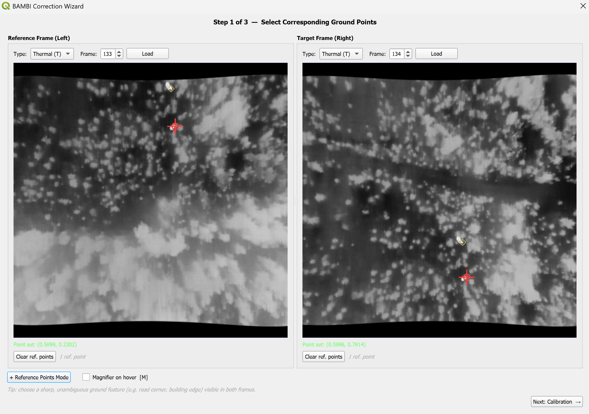

#### Step 2 — Calibration

The two selected points for matching are geo-referenced onto the DEM and visualized as circle markers in the **Circle Visualization** panel. Each circle is centred on the camera's XY position; the radius is the horizontal distance from the camera to the geo-referenced ground point. When the correction is correct the two circles intersect and the cross markers (×) as well as the additional visual reference points overlap.

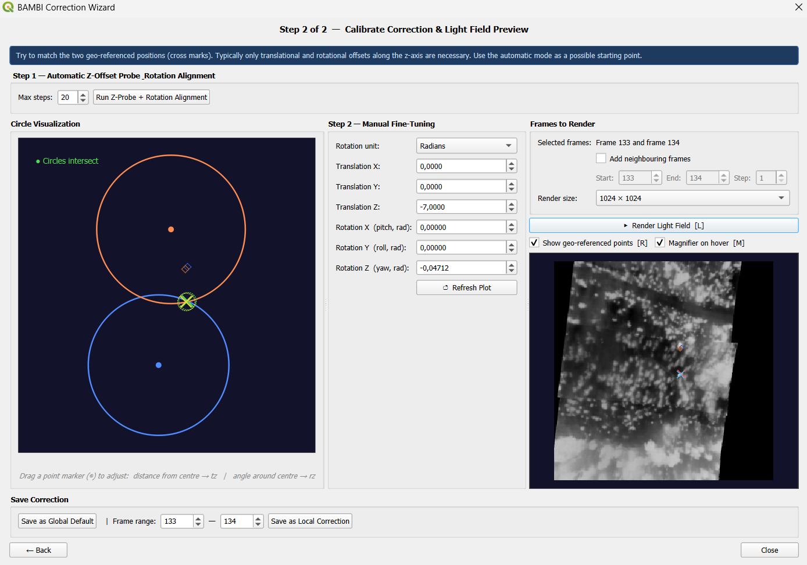

##### Automatic Mode

Click **Run Z-Probe + Rotation Alignment** to let the wizard find a starting correction automatically:

1. **Z-offset probe**: steps the z-translation in ±1 m increments until the two circles transition from non-intersecting to intersecting
2. **Yaw alignment sweep**: scans 360 candidate yaw values and picks the one that minimises the distance between the two geo-referenced match points

#### Manual Fine-Tuning

All six correction components (translation X/Y/Z, rotation X/Y/Z) can be adjusted with the spinboxes or via click/drag in the circle plot. 
Rotation values can be entered in **radians** or **degrees** via the unit toggle.

> Typically only the **z-translation** (altitude offset) and **z-rotation** (yaw) need adjustment.

#### Light-Field Preview & Save

A light-field integral image is rendered using the found correction and displayed in the preview panel.

- Toggle **Show geo-referenced points** to overlay the two calibration reference points (red × and blue ×) on the render — no re-rendering needed
- Use **Add neighbouring frames** to include frames before and after the selected indices for a denser render
- Choose the render resolution (512, 1024, or 2048 pixels)

#### Saving

| Button | Effect |
|--------|--------|
| **Save as Global Default** | Writes `translation` and `rotation` as the top-level values in `correction.json` — applied to all frames that have no local override |
| **Save as Local Correction** | Appends an `additional` entry with the specified start/end frame range to `correction.json` — overrides the global default for those frames only |

---

## Camera Calibration Wizard

Cameras show distortions due to the lenses. Because of this distortions image positions can't be mapped accurately. To address this, we need to calibrate the cameras and calculate distortion coefficients. 
The Camera Calibration Wizard estimates intrinsic camera parameters and exports them as calibration JSON files that can be used directly as input for the main processing pipeline. It is opened via the dedicated toolbar button next to the Correction Wizard.

> **Note:** Most drones do not support open gate recording, which means video and photo modes use different sensor crops and field-of-view settings. Calibrations from video footage are therefore **not interchangeable** with photo calibrations — always calibrate with the same input type you plan to use for processing. For video based calibration we recommend creating multiple short recordings ~1 sec showing a reference object from multiple perspectives. When using auto-focus mode, the drone could adapt the lense setup. Different setups can also lead to (at least small) differences, so try to have a comparable setup during calibration compared to your mission setup (e.g. distance from camera to object of interest). For stereo calibration setup, the recorded data should contain clearly distinguishable structures that are visible in both RGB and thermal imagery and appear across at least once everywhere in the image space (upper left corner, upper right corner, center of the image, lower left, lower right, etc.), to ensure robust calibration over the full field of view. Buildings have proven to be particularly suitable targets, especially roofs with sharp edges or solar panels, as they provide both geometric detail and strong thermal contrast. Facades with windows can also be used, although maintaining a consistent distance is more challenging in side views. It is important that the selected features are clearly recognizable in both modalities to achieve reliable results.


### Calibration Modes

#### Single Camera (Structure from Motion)

Uses pycolmap's incremental SfM pipeline to recover intrinsic parameters (focal length, principal point, and distortion coefficients) from a set of overlapping images or video frames of a static scene.

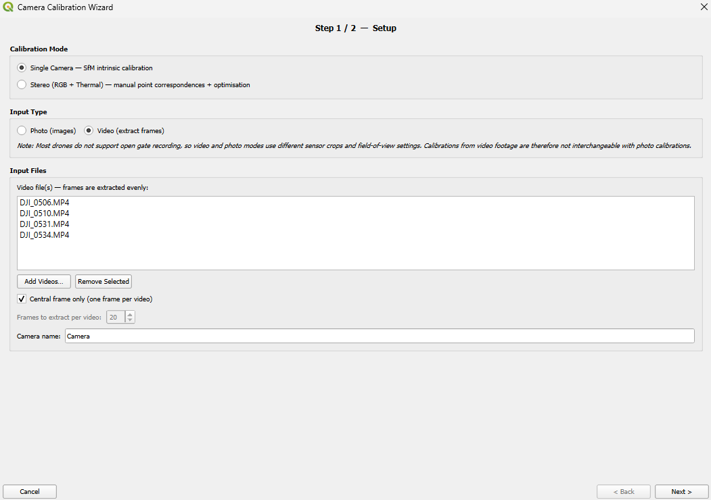

**Input options:**

| Option | Description |
|--------|-------------|
| Photo (images) | Add one or more still images showing the scene from multiple angles |
| Video (extract frames) | Add one or more video files; frames are extracted automatically before SfM |

When video input is selected, two extraction strategies are available:

- **Every N frames** — extracts a configurable number of evenly-spaced frames per video (default: 20). A progress bar is shown during extraction.
- **Central frame only** — extracts a single frame from the centre of each video. Useful when you have many short clips and want one representative frame per clip.

**Output:** One JSON file per camera:
```json
{
    "ret": 0.412,
    "mtx": [[fx, 0, cx], [0, fy, cy], [0, 0, 1]],
    "dist": [k1, k2, p1, p2, k3],
    "name": "Camera"
}
```

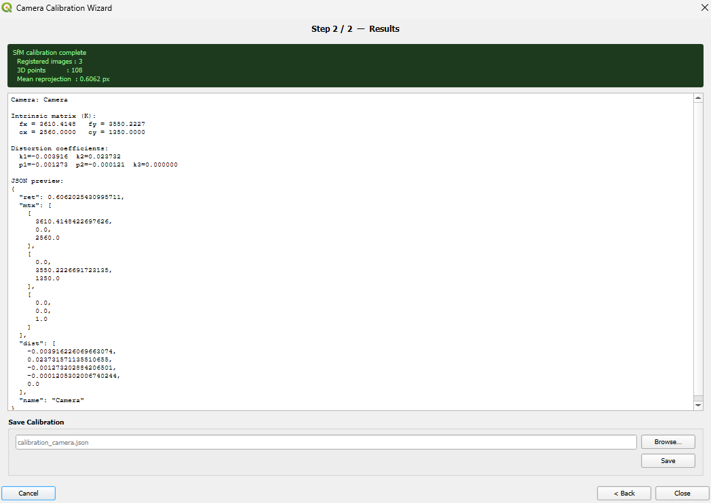

---

#### Stereo (RGB + Thermal)

Calibrates a paired RGB and thermal camera system by optimising the thermal camera's intrinsics so that manually annotated corresponding points reproject correctly into RGB space. The RGB camera is treated as the fixed reference and is not modified. Process wise, we recommend to use a single calibration for the RGB camera first and apply a stereo calibration afterwards using the undistorted RGB frames, to spatially align the thermal frames. 

**Algorithm:**
1. An initial homography (RANSAC, 15 px threshold) maps thermal points into RGB space
2. Nelder-Mead optimisation (10 × 50 000 iterations) refines the thermal intrinsics (fx, fy, cx, cy, and 5 distortion coefficients) by minimising the mean-squared reprojection error

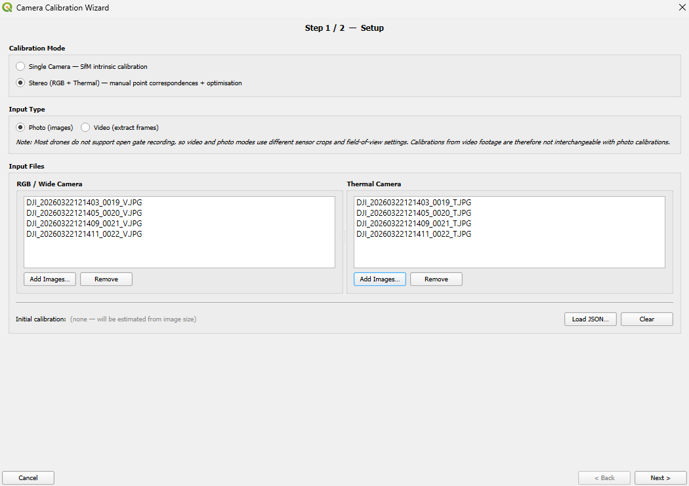

**Input options:**

| Option | Description |
|--------|-------------|
| Photo (images) | Select one or more RGB images and the matching thermal images |
| Video (extract frames) | Select one RGB video and one thermal video; the central frame of each is extracted automatically |

##### Annotating Corresponding Points

After input is configured, the annotation page shows the RGB and thermal frames side by side. Click on the same identifiable feature (e.g. a road marking, building corner, or any fixed object) in both images to place a point pair.

- Either image can be clicked first to start a point pair — the other image then becomes active to complete it
- Enable the **Magnifier** (checkbox or press `M`) to show a circular loupe under the cursor for sub-pixel precision
- Use **Save Points…** / **Load Points…** to persist and reload annotation work between sessions

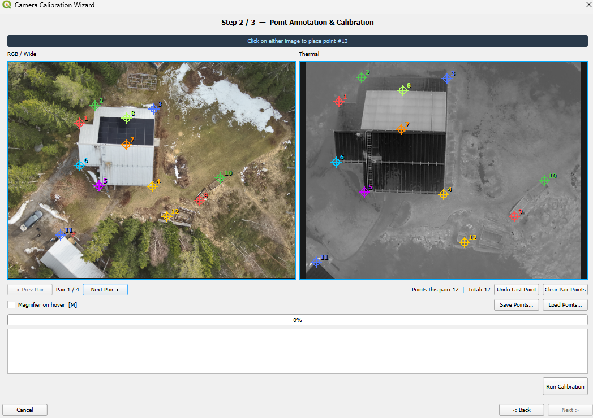

**Output:** Two separate JSON files (one per camera):

*Thermal:*
```json
{
    "ret": null,
    "mtx": [[fx, 0, cx], [0, fy, cy], [0, 0, 1]],
    "dist": [k1, k2, p1, p2, k3],
    "name": "Thermal"
}
```

*RGB / Wide:*
```json
{
    "ret": null,
    "mtx": [[fx, 0, cx], [0, fy, cy], [0, 0, 1]],
    "dist": [k1, k2, p1, p2, k3],
    "name": "Wide"
}
```

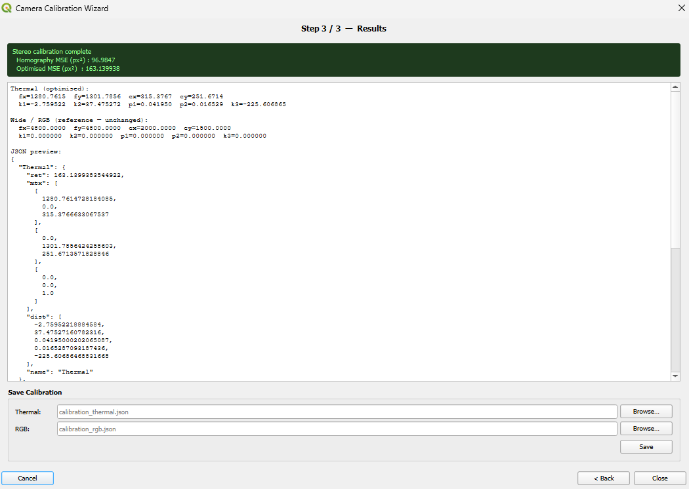

---

## Thermal Image Viewer

The Thermal Image Viewer is a standalone non-modal dialog for inspecting individual DJI radiometric thermal images. Open it via the **Thermal Image Viewer** toolbar button or the plugin menu.

> **Requires DJI Thermal SDK** — install it via the [Dependency Manager](#dependency-manager).

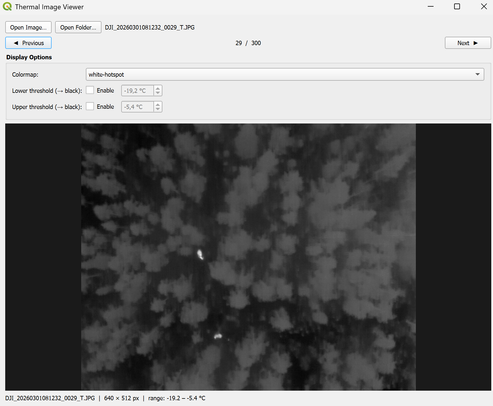

Key features:

- Load any DJI radiometric thermal JPEG or TIFF directly
- Choose from multiple **colormaps** (`white-hotspot`, `black-hotspot`, `plasma`, `inferno`, `magma`, `viridis`, `jet`)
- Set optional **lower and upper temperature thresholds** (°C) that clip the display range, making it easier to isolate warm or cold targets
- Pixel temperature readout on hover

---

## Random Flight Strategy Planner

The Random Flight Strategy Planner generates randomized transect-based survey routes for drone wildlife missions. Open it via the **Random Flight Strategy Planner** toolbar button or the plugin menu.

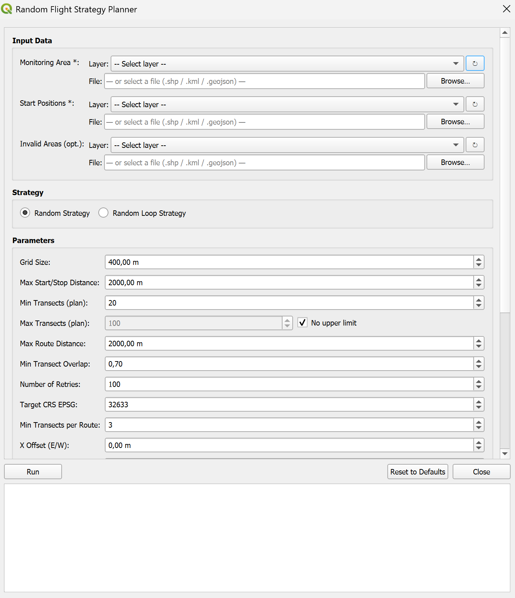

> **Requires Fiona and simplekml** — install them via the [Dependency Manager](#dependency-manager).

### Inputs

| Input | Description |
|-------|-------------|
| **Monitoring Area** | Polygon layer or external file (GeoJSON, KML, Shapefile) defining the survey boundary |
| **Start Points** | Point layer or external file with candidate take-off/landing positions |
| **Invalid Areas** *(optional)* | Polygon layer or external file marking no-fly zones or exclusion areas |
| **Target Folder** | Output directory for all generated files |

### Strategy Options

| Strategy | Description |
|----------|-------------|
| **Random** | Generates independent randomized transect routes |
| **Random Loop** | Generates routes that form closed loops, returning to the start point |

### Parameters

| Parameter | Description |
|-----------|-------------|
| **Grid size** | Side length (m) of the grid cells used to discretise the monitoring area |
| **Max start/stop distance** | Maximum allowed distance (m) from a start point to the first/last transect |
| **Min / Max transects** | Minimum (and optional maximum) number of transects per route |
| **Max distance** | Maximum total route length (m) |
| **Min transect overlap** | Minimum required overlap fraction between consecutive transects |
| **Number of retries** | How many times to retry route generation before giving up |
| **Target CRS (EPSG)** | UTM CRS for all spatial computations |
| **Min transects per route** | Minimum transects required for a route to be considered valid |
| **Offset X / Y** | Translate the grid in X and Y (m) |
| **Padding** | Shrink the effective planning area by this many metres on each side |
| **Seed** | Random seed for reproducible results (leave empty for a random seed) |
| **Max overlapping transects** | Maximum number of transects allowed to overlap with already-planned ones |
| **Max number of flights** | Maximum total number of valid routes to generate |
| **Random search** | When enabled, transects are selected randomly rather than sequentially |
| **Retries per route** | Number of attempts per individual route before skipping |

All parameter values are **persisted across sessions**. Use the **Reset to Defaults** button to restore factory values.

### Outputs

After planning completes, results are saved to the target folder and automatically imported as styled QGIS layers:

```
<target_folder>/
├── grid.geojson                      # Full discretised grid (all candidate points)
├── grid_filtered.geojson             # Grid points inside the monitoring area
├── transects_valids.geojson          # All valid transect segments
├── startpoints.geojson               # Candidate start positions
└── routes/
    └── valid/
        ├── route_0.geojson           # Full mixed-geometry route (waypoints + segments)
        └── ...
```

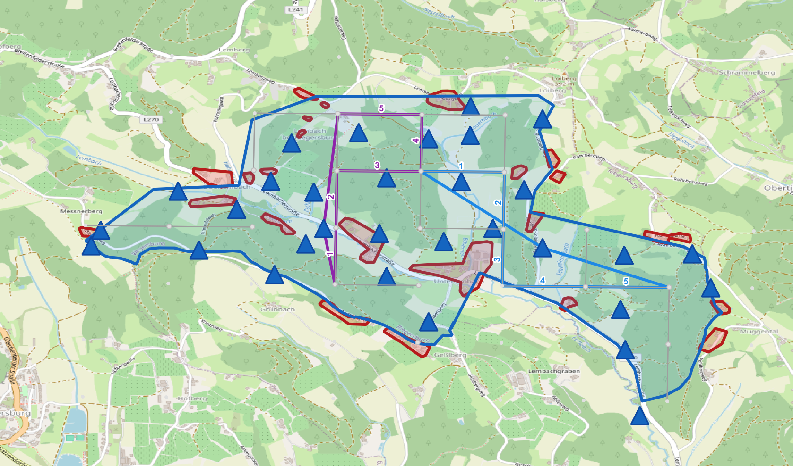

Each route is imported as a sub-group containing:
- **Route** — solid total-route `LineString` in a unique colour
- **Transects** — dashed survey segments with sequential **1, 2, 3 … labels** visible on the map

---

## Input File Formats

### Calibration JSON

```json
{
    "mtx": [[fx, 0, cx], [0, fy, cy], [0, 0, 1]],
    "dist": [k1, k2, p1, p2, k3]
}
```

### DEM Metadata JSON

```json
{
    "origin": [UTM_x, UTM_y, UTM_z],
    "origin_wgs84": {
        "latitude": 47.xxx,
        "longitude": 14.xxx,
        "altitude": 500.0
    }
}
```

### Correction JSON (Optional)

```json
{
    "translation": {"x": 0.0, "y": 0.0, "z": 0.0},
    "rotation": {"x": 0.0, "y": 0.0, "z": 0.0},
    "additional": [
        {
            "start": 10,
            "end": 100,
            "translation": {"x": 0.0, "y": 0.0, "z": 0.0},
            "rotation": {"x": 0.0, "y": 0.0, "z": 0.0}
        }
    ]
}
```

---

## Output Structure

A complete run produces the following folder structure:

```
target_folder/
├── frames_t/                                  # Extracted/undistorted thermal frames
│   ├── frame_000000.jpg
│   └── ...
├── frames_w/                                  # Extracted/undistorted RGB frames
│   ├── frame_000000.jpg
│   └── ...
├── poses_t.json                               # Camera pose per thermal frame
├── poses_w.json                               # Camera pose per RGB frame
├── mask_T.png                                 # Thermal undistortion mask
├── mask_W.png                                 # RGB undistortion mask
├── flight_route/
│   ├── flight_route.geojson                   # AirData GPS flight path (LineString)
│   ├── camera_positions.geojson               # Per-frame camera positions (Points)
│   ├── perpendicular.json                     # Detection perpendicular distances (flat)
│   ├── perpendicular_by_image.json            # Detection perpendicular distances (by image)
│   ├── perpendicular_tracks.json              # Track perpendicular distances (flat)
│   └── perpendicular_tracks_by_track.json     # Track perpendicular distances (by track)
├── detections/
│   └── detections.txt                         # Raw YOLO detections
├── georeferenced/
│   └── georeferenced.txt                      # Geo-referenced detections (UTM)
├── tracks/
│   ├── tracks_pixel.csv                       # Tracks in pixel coordinates
│   └── tracks.csv                             # Geo-referenced tracks (UTM)
├── fov/
│   ├── fov_polygons.txt                       # Per-frame FoV polygon coordinates
│   └── merged_fov.geojson                     # Combined coverage area
├── orthomosaic/
│   └── orthomosaic.tif                        # Georeferenced mosaic (COG GeoTIFF)
├── geotiffs/
│   ├── frame_000000.tiff
│   └── ...
├── segmentation/
│   ├── segmentation_pixel.json                # Pixel-space segmentation masks
│   └── segmentation_georef.json               # Geo-referenced segmentation polygons
└── models/
    ├── thermal_animal_detector.pt             # BAMBI thermal detection model
    ├── osnet_x0_5_bambi_thermal_omni.pt       # BAMBI Re-ID model
    └── osnet_x0_25_msmt17.pt                  # BoxMOT default Re-ID model
```

---

## Troubleshooting

### Model Download Fails

- Check your internet connection
- Download manually from HuggingFace: [Detection (thermal_animal_detector.pt)](https://huggingface.co/cpraschl/bambi-thermal-detection), [Re-ID (osnet_x0_5_bambi_thermal_omni.pt)](https://huggingface.co/cpraschl/bambi-thermal-omni)
- Place the `.pt` file in `target_folder/models/`

### Geo-referencing Issues

- Ensure the DEM covers your entire flight area
- Verify the DEM metadata JSON has correct origin coordinates
- Check that the target CRS matches your DEM projection

### GeoTIFF Conversion: Wrong Origin Location

- If the converted DEM places the origin in the wrong country, the GeoTIFF likely has incorrect CRS metadata
- Enter the correct CRS in the **Source CRS** field (e.g. `EPSG:3006` for SWEREF99TM) before converting
- Verify the correct CRS by loading the file in QGIS and checking its reported coordinate system

### Photo Mode: Images Not Matched to GPS

- Ensure image timestamps (EXIF) are in UTC or that the correct timezone offset is configured in the **Configuration** tab
- Verify the AirData CSV covers the same time range as the photo session

### No Tracks Generated

- Lower the detection confidence threshold
- Adjust the IoU threshold for tracking
- Verify that detections were successfully generated in Step 3

### Perpendicular Distances Not Calculated

- Run **Generate Flight Route** before **Calculate Perpendicular** — the AirData GPS `LineString` is required
- Ensure the AirData CSV contains enough GPS records (at least 2 valid positions)
- For track perpendicular: ensure **Track Animals** has been completed first

### BoxMOT Import Errors

- Ensure you're installing in the correct Python environment (OSGeo4W Shell)
- Try: `pip install --upgrade boxmot`
- Check for conflicting package versions

### Memory Issues with Large Datasets

- Reduce the number of frames processed at each step; back up intermediate results and rerun with different settings
- For orthomosaics and GeoTIFFs: reduce resolution or decrease the max tile size parameter

### No module named 'bambi'

If you get the processing error `No module named 'bambi'`, you have not installed the `bambi_detection` dependency or you have not restarted QGIS after installation via OSGeo4W.

### No module named 'alfspy'

If you get the processing error `No module named 'alfs_py'`, you have not installed the `alfs_py` dependency or you have not restarted QGIS after installation via OSGeo4W.

### Problems Installing Dependencies

If you are installing dependencies using the commands above, Git must be installed and available in the OSGeo4W Shell's PATH. On Windows, edit `OSGeo4W.bat` to add:

```text
@echo off
call "%~dp0\bin\o4w_env.bat"
set "PATH=C:\Users\<username>\AppData\Local\Programs\Git\cmd\;%PATH%"
@echo on
@if [%1]==[] (echo run o-help for a list of available commands & cd /d "%~dp0" & cmd.exe /k) else (cmd /c "%*")
```

Alternatively, download the repositories and install from local paths:

```shell
pip install <path>/alfs_py
pip install <path>/bambi_detection
```

---

## Citation

If you use this plugin in your research, please cite:

```bibtex
@Article{praschlGeoReferencedTracking,
    author  = {Praschl, Christoph and Coucke, Vincent and Maschek, Anna and Schedl, David},
    title   = {Stay Local or Go Global: Geo-Referenced Bounding Boxes for
               Tracking Wildlife in Thermal Drone Videos},
}
```

---

## Screenshots

### Plugin Interface


### Dependency Manager


### Extraction Configuration


#### Video Input

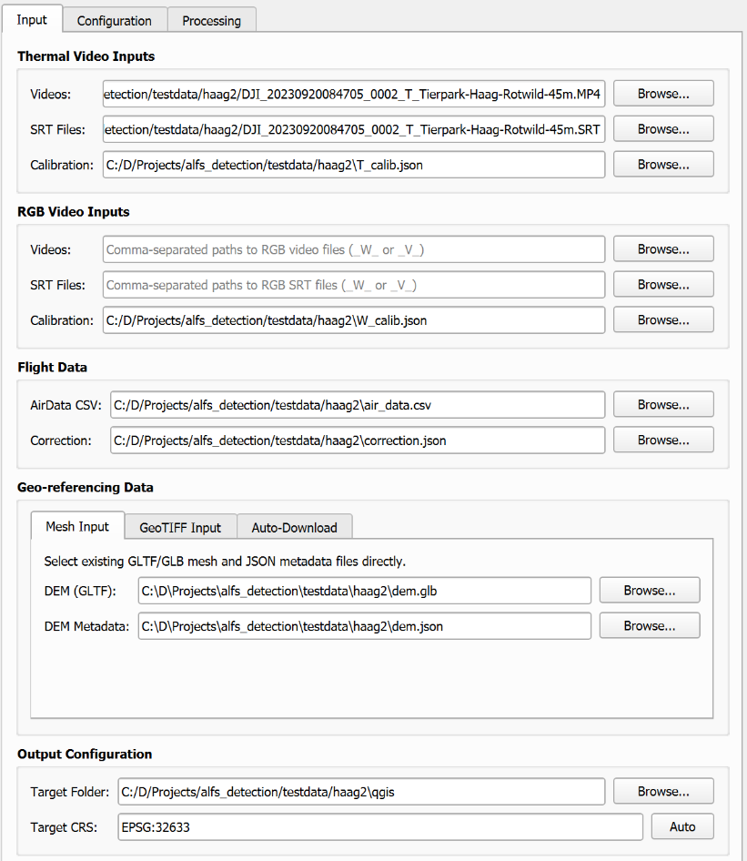

#### Photo Input


### Flight Route and Camera Positions

#### Video Route


#### Photo Route

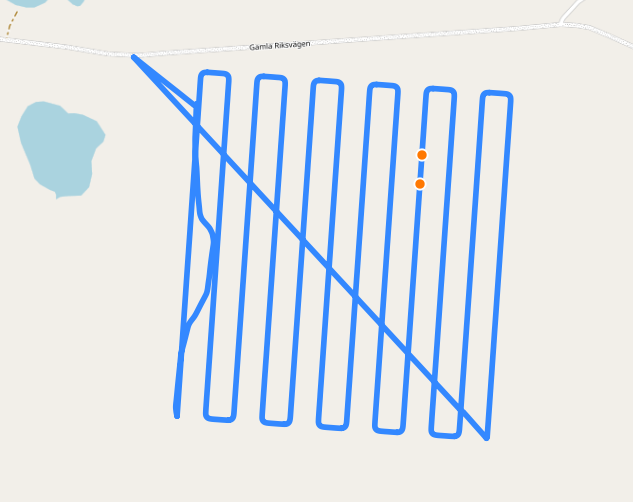


### Detections and Geo-referencing


#### Perpendicular distances


### Track Visualization


### Field of View


### Orthomosaic and GeoTIFF Export


### Segmentation


### Interactive Selection Tools

#### Detection / Track Selection


#### Field-of-View Selection


### Correction Calibration Wizard

#### Toolbar Button


#### Step 1 — Select Corresponding Ground Points


#### Step 2 — Calibration


#### Step 3 — Light-Field Preview & Save

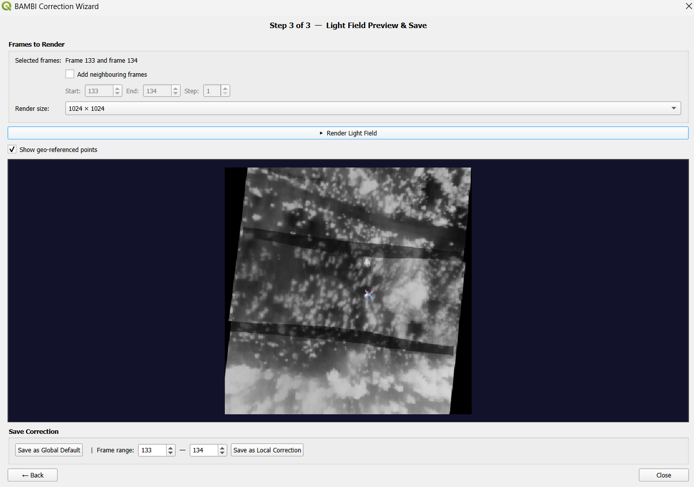

### Thermal Image Viewer


### Random Flight Strategy Planner

#### Dialog


#### Results in QGIS


### Camera Calibration Wizard

#### Toolbar Button


#### Single Camera — Setup


#### Single Camera — Results


#### Stereo — Setup


#### Stereo — Point Annotation


#### Stereo — Results


---

---

## License

This plugin is released under the **MIT License**.

See [LICENSE](LICENSE) for details.

---

## Credits

**Author:** Christoph Praschl, Anna Maschek, David C. Schedl
**Organization:** University of Applied Sciences Upper Austria, Hagenberg Campus

### Dependencies

- [ALFS-PY Framework](https://github.com/bambi-eco/alfs_py)
- [BAMBI Detection Framework](https://github.com/bambi-eco/bambi_detection)
- [Ultralytics YOLO](https://github.com/ultralytics/ultralytics)
- [BoxMOT](https://github.com/mikel-brostrom/boxmot) (optional)
- [Geo-Referenced Tracking](https://github.com/bambi-eco/Geo-Referenced-Tracking) (optional)
- [DJI Thermal SDK](https://www.dji.com/at/downloads/softwares/dji-thermal-sdk) (optional, required for Thermal Image Viewer and thermal visualisation)
- [Fiona](https://github.com/Toblerity/Fiona) (optional, required for Flight Strategy Planner)
- [simplekml](https://simplekml.readthedocs.io/) (optional, required for Flight Strategy Planner)

---

## Contributing

Contributions are welcome! Please feel free to submit issues or pull requests.


