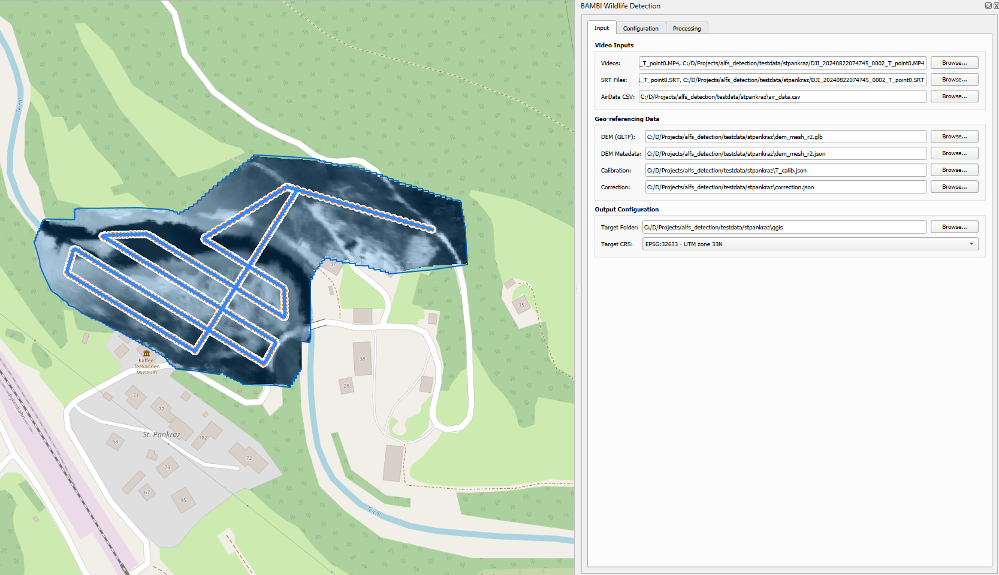

# BAMBI QGIS Plugin

[](https://plugins.qgis.org/plugins/bambi_wildlife_detection/)
[](https://qgis.org)
[](https://opensource.org/license/mit)
[](https://www.python.org/)

Detect, track, and geo-reference wildlife in aerial drone recordings, directly in QGIS. BAMBI processes drone **videos** or **still photo** collections from DJI Enterprise drones (thermal and/or RGB), projects every detection onto a Digital Elevation Model, and loads all results as styled map layers.



## What it does

- **Detect & track animals**: YOLO-based detection (model auto-downloaded from HuggingFace) and multi-object tracking with built-in, BoxMOT, or geo-referenced backends; pre-computed [TRex](https://trex.run) tracklets can be imported instead of running a tracker
- **Geo-reference everything**: detections, tracks, and SAM3 segmentations are projected onto a DEM to real-world UTM coordinates
- **Survey analytics**: perpendicular distance sampling from detections/tracks to the flight route, per-frame camera field-of-view footprints, coverage areas, kernel-density heatmaps of animal locations, and line-transect distance-sampling density/abundance estimation with confidence intervals
- **Map products**: georeferenced per-frame GeoTIFFs, true orthomosaics, and Airborne Light Field Sampling (ALFS) mosaics
- **Calibration wizards**: guided workflows for camera intrinsics (single-camera SfM or stereo RGB+thermal) and per-flight positional/rotational corrections
- **Companion tools**: video creator for shareable result videos, radiometric thermal image viewer, randomized transect flight planner, interactive map-canvas inspectors, and a built-in dependency manager

## Installation

1. In QGIS, go to **Plugins → Manage and Install Plugins…**, search for **BAMBI**, and install it directly from the [official QGIS Plugin Repository](https://plugins.qgis.org/plugins/bambi_wildlife_detection/)
2. Open the plugin's **Dependency Manager** (toolbar button) and install the two required packages: **BAMBI Detection Framework** and **ALFS-PY**
3. **Restart QGIS**: newly installed Python packages are only picked up at startup

Alternatively, install from a ZIP file ([GitHub releases](https://github.com/bambi-eco/Bambi-QGIS/releases) or a zipped development version of this repository) or copy the plugin folder manually; see the [Installation Guide](docs/installation.md).

Optional capabilities (GPU inference, BoxMOT trackers, camera calibration via SfM, flight planning, DJI Thermal SDK) can be added the same way. See the [Installation Guide](docs/installation.md) for details and manual installation methods.

## Quick start

1. Click the **BAMBI** icon in the toolbar to open the dock widget
2. In the **Input** tab, choose **Video** or **Photo** mode and select your recordings, camera calibration, AirData flight log, DEM, target CRS, and output folder
3. Adjust per-step settings in the **Configuration** tab (detection confidence, tracker backend, thermal colormaps, …)
4. Run the steps in order in the **Processing** tab, from **1. Extract Frames** to **10. Geo-Reference Segmentation**
5. Use the **→ Add … to QGIS** buttons after each step to load the results as styled layers

What you need as input: MP4 videos + SRT subtitle files (video mode) *or* a folder of still images (photo mode), an AirData flight log CSV, a camera calibration JSON, and a DEM. The plugin can download DEMs automatically (Austria), convert any GeoTIFF DEM, or generate a flat surface mesh for aquatic surveys, and the calibration JSON can be created with the built-in Camera Calibration Wizard.

## Documentation

| Guide | Contents |
|-------|----------|
| [Installation & Dependencies](docs/installation.md) | Install methods, Dependency Manager, optional packages, GPU support, DJI Thermal SDK |
| [Processing Pipeline](docs/pipeline.md) | Input modes and file formats, configuration, all processing steps, output folder structure |
| [DEM Import & Conversion](docs/dem.md) | Automatic download (Austria), GeoTIFF conversion, manual DEMs, flat surface meshes for aquatic surveys |
| [Correction Wizard](docs/correction-wizard.md) | Finding per-flight positional/rotational correction factors |
| [Camera Calibration Wizard](docs/camera-calibration.md) | Estimating camera intrinsics for single cameras (SfM) and stereo RGB+thermal setups |
| [Tools](docs/tools.md) | Video Creator, Thermal Image Viewer, interactive map-canvas inspectors |
| [Flight Strategy Planner](docs/flight-planner.md) | Randomized transect-based survey route generation |
| [Troubleshooting](docs/troubleshooting.md) | Common errors and how to resolve them |

## Requirements

- **QGIS** 3.22+ (Windows, Linux, or macOS) with its bundled Python 3.9+
- **Drone data** from DJI Enterprise drones (M30T, M3T, M4T, M300, …) with thermal and/or RGB cameras; GPS RTK recordings recommended for best geo-referencing accuracy
- **Video mode** needs SRT subtitle files and an AirData flight log CSV; **photo mode** needs still images with EXIF timestamps and an AirData CSV

## Citation

If you use this plugin in your research, please cite:

```bibtex
@Article{praschlGeoReferencedTracking,
    author  = {Praschl, Christoph and Coucke, Vincent and Maschek, Anna and Schedl, David},
    title   = {Stay Local or Go Global: Geo-Referenced Bounding Boxes for
               Tracking Wildlife in Thermal Drone Videos},
}
```

## License & Credits

Released under the **MIT License**; see [LICENSE](LICENSE).

**Authors:** Christoph Praschl, Anna Maschek, David C. Schedl
**Organization:** University of Applied Sciences Upper Austria, Hagenberg Campus

Built on the [BAMBI Detection Framework](https://github.com/bambi-eco/bambi_detection), [ALFS-PY](https://github.com/bambi-eco/alfs_py), [Ultralytics YOLO](https://github.com/ultralytics/ultralytics), and optionally [BoxMOT](https://github.com/mikel-brostrom/boxmot), [Geo-Referenced Tracking](https://github.com/bambi-eco/Geo-Referenced-Tracking), the [DJI Thermal SDK](https://www.dji.com/at/downloads/softwares/dji-thermal-sdk), [Fiona](https://github.com/Toblerity/Fiona), and [simplekml](https://simplekml.readthedocs.io/).

Contributions are welcome; please submit issues or pull requests.


