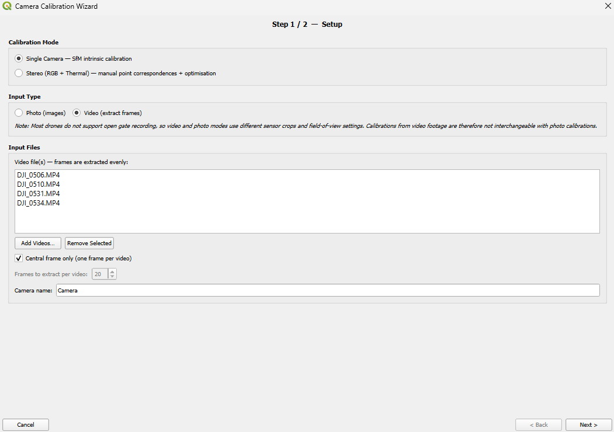
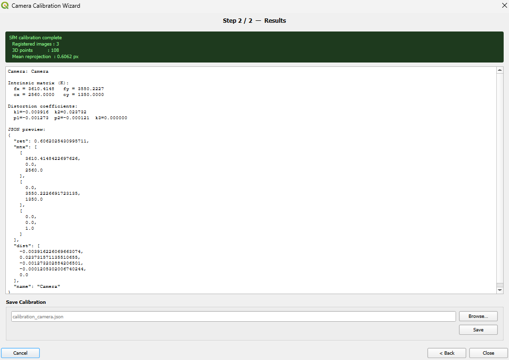
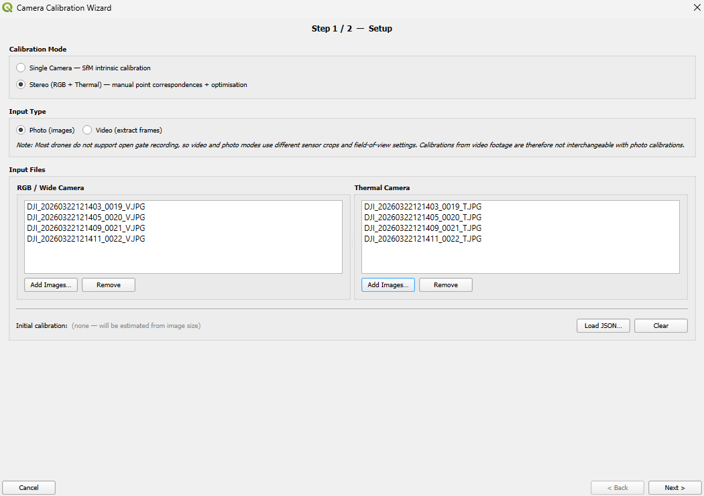
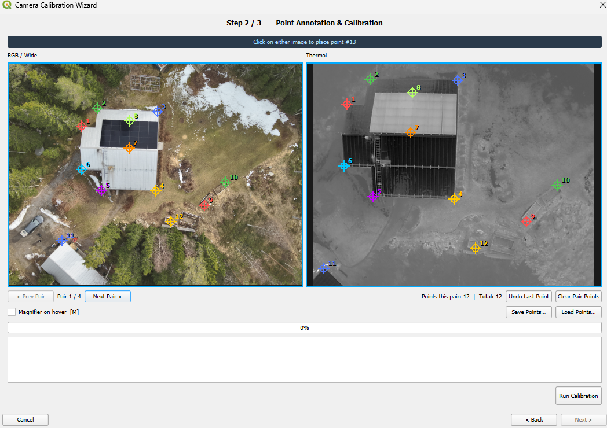
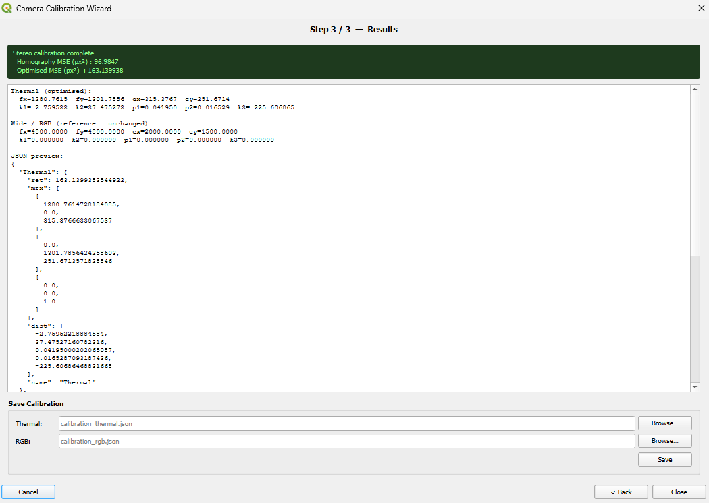

# Camera Calibration Wizard

Cameras show distortions due to their lenses, so image positions can't be mapped accurately without correction. The Camera Calibration Wizard estimates intrinsic camera parameters (focal length, principal point, distortion coefficients) and exports them as calibration JSON files that can be used directly as input for the [main processing pipeline](pipeline.md). It is opened via the dedicated toolbar button next to the Correction Wizard.

## Recording calibration data

- **Video and photo calibrations are not interchangeable.** Most drones do not support open gate recording, so video and photo modes use different sensor crops and field-of-view settings. Always calibrate with the same input type you plan to use for processing.
- For video-based calibration we recommend creating multiple short recordings (~1 s) showing a reference object from multiple perspectives.
- When using auto-focus mode, the drone may adapt the lens setup. Try to keep the calibration setup comparable to your mission setup (e.g. distance from camera to object of interest).
- For **stereo calibration**, the recorded data should contain clearly distinguishable structures that are visible in both RGB and thermal imagery and appear at least once everywhere in the image space (all four corners and the center), to ensure robust calibration over the full field of view. Buildings have proven particularly suitable, especially roofs with sharp edges or solar panels, which provide both geometric detail and strong thermal contrast. Facades with windows also work, although maintaining a consistent distance is more challenging in side views.

## Single camera (Structure from Motion)

Uses pycolmap's incremental SfM pipeline to recover intrinsic parameters from a set of overlapping images or video frames of a static scene.

> **Requires pycolmap**: install it via the [Dependency Manager](installation.md#dependency-manager). Not needed for stereo calibration.



**Input options:**

| Option | Description |
|--------|-------------|
| Photo (images) | Add one or more still images showing the scene from multiple angles |
| Video (extract frames) | Add one or more video files; frames are extracted automatically before SfM |

When video input is selected, two extraction strategies are available:

- **Every N frames**: extracts a configurable number of evenly-spaced frames per video (default: 20). A progress bar is shown during extraction.
- **Central frame only**: extracts a single frame from the centre of each video. Useful when you have many short clips and want one representative frame per clip.

**Output:** One JSON file per camera:
```json
{
    "ret": 0.412,
    "mtx": [[fx, 0, cx], [0, fy, cy], [0, 0, 1]],
    "dist": [k1, k2, p1, p2, k3],
    "name": "Camera"
}
```



## Stereo (RGB + thermal)

Calibrates a paired RGB and thermal camera system by optimising the thermal camera's intrinsics so that manually annotated corresponding points reproject correctly into RGB space. The RGB camera is treated as the fixed reference and is not modified.

> **Recommended workflow**: Run a single-camera calibration for the RGB camera first, then apply the stereo calibration using the undistorted RGB frames to spatially align the thermal frames.

**Algorithm:**
1. An initial homography (RANSAC, 15 px threshold) maps thermal points into RGB space
2. Nelder-Mead optimisation (10 × 50 000 iterations) refines the thermal intrinsics (fx, fy, cx, cy, and 5 distortion coefficients) by minimising the mean-squared reprojection error



**Input options:**

| Option | Description |
|--------|-------------|
| Photo (images) | Select one or more RGB images and the matching thermal images |
| Video (extract frames) | Select one RGB video and one thermal video; the central frame of each is extracted automatically |

### Annotating corresponding points

After input is configured, the annotation page shows the RGB and thermal frames side by side. Click on the same identifiable feature (e.g. a road marking, building corner, or any fixed object) in both images to place a point pair.

- Either image can be clicked first to start a point pair; the other image then becomes active to complete it
- Enable the **Magnifier** (checkbox or press `M`) to show a circular loupe under the cursor for sub-pixel precision
- Use **Save Points…** / **Load Points…** to persist and reload annotation work between sessions



**Output:** Two separate JSON files (one per camera):

*Thermal:*
```json
{
    "ret": null,
    "mtx": [[fx, 0, cx], [0, fy, cy], [0, 0, 1]],
    "dist": [k1, k2, p1, p2, k3],
    "name": "Thermal"
}
```

*RGB / Wide:*
```json
{
    "ret": null,
    "mtx": [[fx, 0, cx], [0, fy, cy], [0, 0, 1]],
    "dist": [k1, k2, p1, p2, k3],
    "name": "Wide"
}
```


