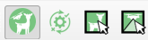
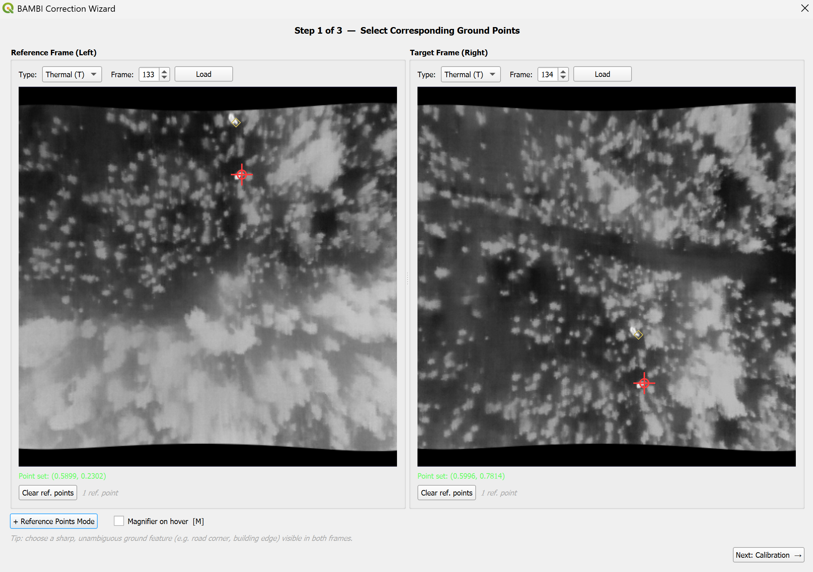
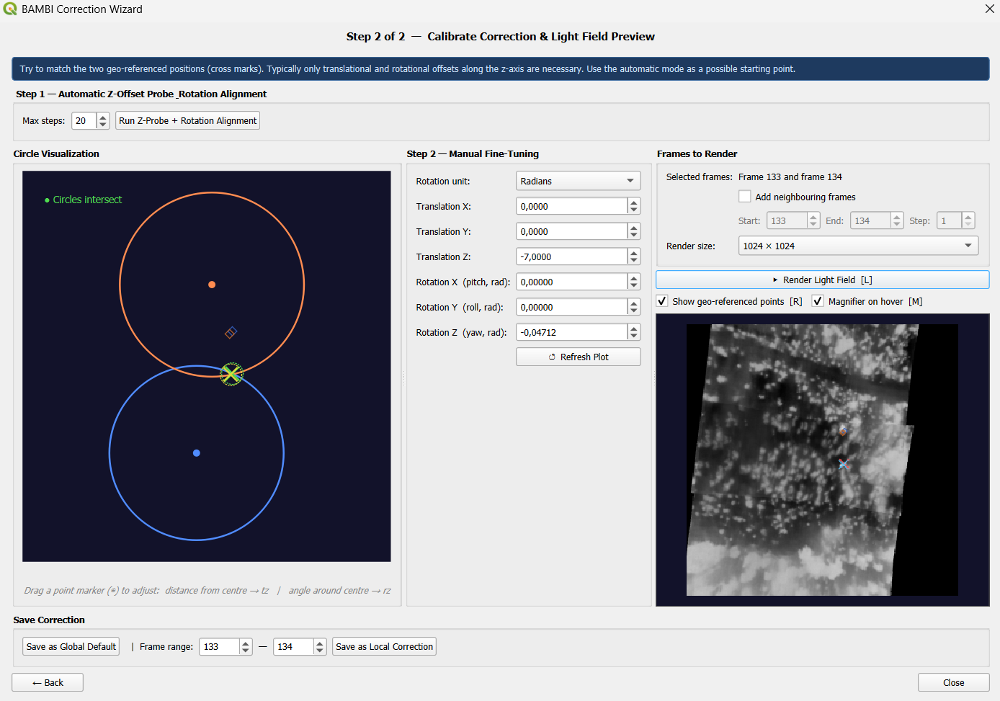

# Correction Wizard

The Correction Calibration Wizard helps you find and store the positional and rotational correction factors that align the camera poses with the DEM. It is opened via the dedicated toolbar button between the main BAMBI icon and the inspector tools.

> **Prerequisite**: Frames must be extracted first ([step 1](pipeline.md#1-extract-frames)) so that `poses_t.json` / `poses_w.json` exist in the target folder.

## Step 1 — Select corresponding ground points

Two side-by-side frame views (thermal or RGB) are shown. Load a frame for each side using the type selector and frame index, then **click on the same identifiable ground feature** in both images to place a corresponding point for matching.

- Any clearly visible fixed object on the ground works (road marking, building corner, etc.)
- With the "Reference Points Mode" you can add additional (optional) points to visually evaluate the match
- The "Next" button is enabled once both points are placed and the DEM has finished loading

## Step 2 — Calibration

The two selected points for matching are geo-referenced onto the DEM and visualized as circle markers in the **Circle Visualization** panel. Each circle is centred on the camera's XY position; the radius is the horizontal distance from the camera to the geo-referenced ground point. When the correction is correct the two circles intersect and the cross markers (×) as well as the additional visual reference points overlap.

### Automatic mode

Click **Run Z-Probe + Rotation Alignment** to let the wizard find a starting correction automatically:

1. **Z-offset probe**: steps the z-translation in ±1 m increments until the two circles transition from non-intersecting to intersecting
2. **Yaw alignment sweep**: scans 360 candidate yaw values and picks the one that minimises the distance between the two geo-referenced match points

### Manual fine-tuning

All six correction components (translation X/Y/Z, rotation X/Y/Z) can be adjusted with the spinboxes or via click/drag in the circle plot. Rotation values can be entered in **radians** or **degrees** via the unit toggle.

> Typically only the **z-translation** (altitude offset) and **z-rotation** (yaw) need adjustment.

## Step 3 — Light-field preview & save

A light-field integral image is rendered using the found correction and displayed in the preview panel.

- Toggle **Show geo-referenced points** to overlay the two calibration reference points (red × and blue ×) on the render — no re-rendering needed
- Use **Add neighbouring frames** to include frames before and after the selected indices for a denser render
- Choose the render resolution (512, 1024, or 2048 pixels)

### Saving

| Button | Effect |
|--------|--------|
| **Save as Global Default** | Writes `translation` and `rotation` as the top-level values in `correction.json` — applied to all frames that have no local override |
| **Save as Local Correction** | Appends an `additional` entry with the specified start/end frame range to `correction.json` — overrides the global default for those frames only |

See [Correction JSON](pipeline.md#correction-json-optional) for the resulting file format.
