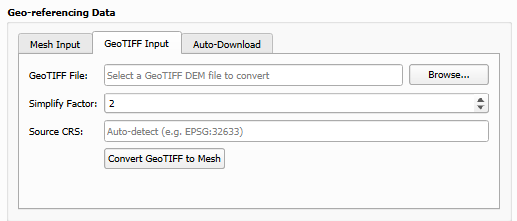

# DEM Import & Conversion

The processing pipeline needs a Digital Elevation Model as a GLB/GLTF mesh with a companion metadata JSON (see [DEM metadata JSON](pipeline.md#dem-metadata-json)). The plugin supports four ways to provide one, available as tabs in the **Input** section of the dock widget.

## 1. Automatic download (Austria only)

Use the **Download DEM (Austria)** option to download and tile Austrian elevation data from the BEV ATOM service automatically.

## 2. Convert a GeoTIFF DEM

Any GeoTIFF DEM can be converted to the required GLB + metadata JSON format using the **GeoTIFF Input** panel:

- **Input file**: Path to the GeoTIFF (`.tif` / `.tiff`)
- **Output folder**: Where the `.glb` and `.json` files will be saved
- **Output CRS**: Target UTM CRS for the mesh (e.g. `EPSG:32633`)
- **Simplification**: Mesh vertex reduction factor (1 = full resolution)
- **Source CRS** *(optional)*: Override the CRS embedded in the file. Use this when the GeoTIFF has incorrect CRS metadata, for example a file containing SWEREF99TM (EPSG:3006) data but tagged as EPSG:32634. Leave empty to auto-detect.

## 3. Flat surface mesh (aquatic/marine surveys)

For surveys over water, where no terrain model exists or is needed (e.g. sharks or manta rays near the water surface), the **Flat Surface** tab generates a flat GLB mesh and its companion JSON:

- **Elevation (MSL)**: Elevation of the flat projection surface in metres above mean sea level. Use `0.0` for sea-surface surveys.
- The mesh origin and extent are derived automatically from the GPS positions in the AirData CSV or SRT files selected in the input section
- The generated `flat_surface_dem.glb` / `flat_surface_dem.json` are written to the target folder and automatically set as the DEM input, so they are used like any other DEM

## 4. Manual DEM

Provide a `.gltf` or `.glb` file and its companion `.json` metadata file directly.

## Troubleshooting

- **Wrong origin location after conversion**: If the converted DEM places the origin in the wrong country, the GeoTIFF likely has incorrect CRS metadata. Enter the correct CRS in the **Source CRS** field before converting. Verify the correct CRS by loading the file in QGIS and checking its reported coordinate system.
- **Geo-referencing issues**: Ensure the DEM covers your entire flight area, the metadata JSON has correct origin coordinates, and the target CRS matches your DEM projection.
