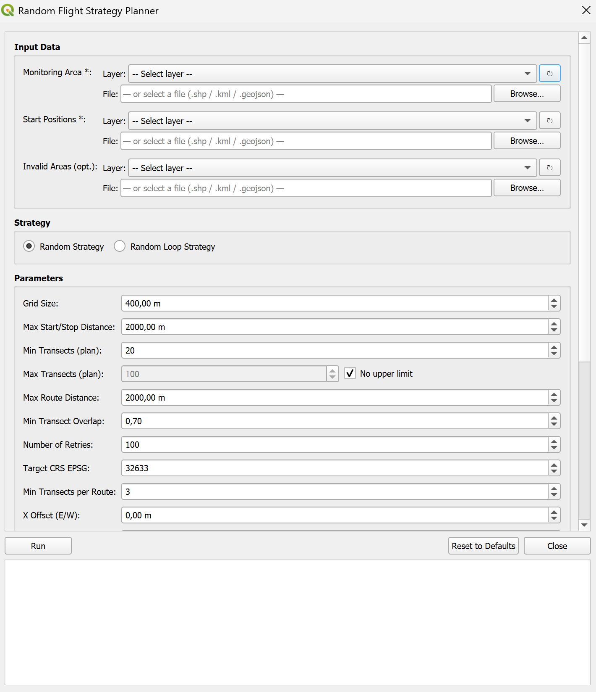
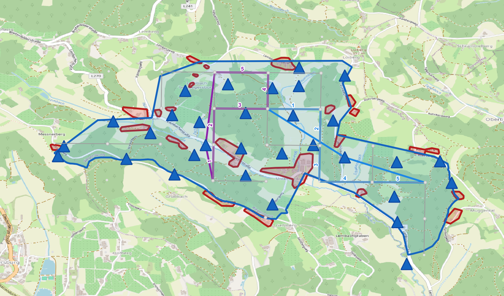

# Random Flight Strategy Planner

The Random Flight Strategy Planner generates randomized transect-based survey routes for drone wildlife missions. Open it via the **Random Flight Strategy Planner** toolbar button or the plugin menu.



> **Requires Fiona and simplekml** — install them via the [Dependency Manager](installation.md#dependency-manager).

## Inputs

| Input | Description |
|-------|-------------|
| **Monitoring Area** | Polygon layer or external file (GeoJSON, KML, Shapefile) defining the survey boundary |
| **Start Points** | Point layer or external file with candidate take-off/landing positions |
| **Invalid Areas** *(optional)* | Polygon layer or external file marking no-fly zones or exclusion areas |
| **Target Folder** | Output directory for all generated files |

## Strategy options

| Strategy | Description |
|----------|-------------|
| **Random** | Generates independent randomized transect routes |
| **Random Loop** | Generates routes that form closed loops, returning to the start point |

## Parameters

| Parameter | Description |
|-----------|-------------|
| **Grid size** | Side length (m) of the grid cells used to discretise the monitoring area |
| **Max start/stop distance** | Maximum allowed distance (m) from a start point to the first/last transect |
| **Min / Max transects** | Minimum (and optional maximum) number of transects per route |
| **Max distance** | Maximum total route length (m) |
| **Min transect overlap** | Minimum required overlap fraction between consecutive transects |
| **Number of retries** | How many times to retry route generation before giving up |
| **Target CRS (EPSG)** | UTM CRS for all spatial computations |
| **Min transects per route** | Minimum transects required for a route to be considered valid |
| **Offset X / Y** | Translate the grid in X and Y (m) |
| **Padding** | Shrink the effective planning area by this many metres on each side |
| **Seed** | Random seed for reproducible results (leave empty for a random seed) |
| **Max overlapping transects** | Maximum number of transects allowed to overlap with already-planned ones |
| **Max number of flights** | Maximum total number of valid routes to generate |
| **Random search** | When enabled, transects are selected randomly rather than sequentially |
| **Retries per route** | Number of attempts per individual route before skipping |

All parameter values are **persisted across sessions**. Use the **Reset to Defaults** button to restore factory values.

## Outputs

After planning completes, results are saved to the target folder and automatically imported as styled QGIS layers:

```
<target_folder>/
├── grid.geojson                      # Full discretised grid (all candidate points)
├── grid_filtered.geojson             # Grid points inside the monitoring area
├── transects_valids.geojson          # All valid transect segments
├── startpoints.geojson               # Candidate start positions
└── routes/
    └── valid/
        ├── route_0.geojson           # Full mixed-geometry route (waypoints + segments)
        └── ...
```



Each route is imported as a sub-group containing:

- **Route** — solid total-route `LineString` in a unique colour
- **Transects** — dashed survey segments with sequential **1, 2, 3 … labels** visible on the map
