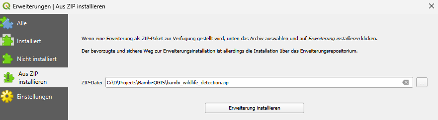
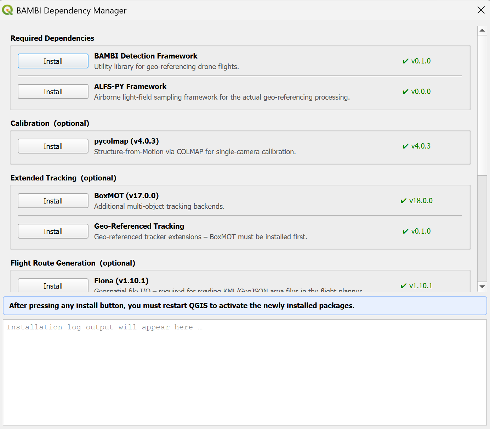
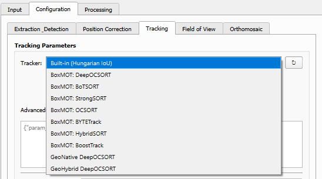

# Installation & Dependencies

## Installing the plugin

### Method 1: QGIS Plugin Repository (recommended)

The plugin is published in the [official QGIS Plugin Repository](https://plugins.qgis.org/plugins/bambi_wildlife_detection/), so it can be installed directly from within QGIS:

1. Open QGIS
2. Go to **Plugins** → **Manage and Install Plugins...**
3. Search for **BAMBI** in the **All** tab
4. Click **Install Plugin**

Updates are offered automatically by QGIS whenever a new version is released to the repository.

### Method 2: Install from ZIP

1. Download the plugin by either
    - Getting the zipped plugin from a [released version](https://github.com/bambi-eco/Bambi-QGIS/releases) (recommended)
    - Or downloading this repository and zipping the `bambi_wildlife_detection` subfolder for the current development version
2. Open QGIS
3. Go to **Plugins** → **Manage and Install Plugins...**
4. Select the **Install from ZIP** tab
5. Browse to the downloaded ZIP file
6. Click **Install Plugin**



### Method 3: Manual installation

1. Download and extract the plugin folder
2. Copy the `bambi_wildlife_detection` folder to your QGIS plugins directory:

   | Platform | Path |
   |----------|------|
   | **Windows** | `C:\Users\<username>\AppData\Roaming\QGIS\QGIS3\profiles\default\python\plugins\` |
   | **Linux** | `~/.local/share/QGIS/QGIS3/profiles/default/python/plugins/` |
   | **macOS** | `~/Library/Application Support/QGIS/QGIS3/profiles/default/python/plugins/` |

3. Restart QGIS
4. Enable the plugin via **Plugins** → **Manage and Install Plugins...**

## Dependency Manager

The Dependency Manager lets you install and update all BAMBI plugin dependencies directly from within QGIS, without needing a terminal or the OSGeo4W Shell. Open it via the **Dependency Manager** toolbar button or the **Plugins → Bambi - QGIS Integration → Dependency Manager** menu entry.



Each dependency group shows the currently installed version (green ✔, orange ⚠ for untested, or grey "not found") and an Install button that runs pip in a background thread, streaming the output to the log area at the bottom of the dialog.

| Group | Packages |
|-------|----------|
| **Required Dependencies** | BAMBI Detection Framework, ALFS-PY Framework |
| **Calibration (optional)** | pycolmap |
| **Extended Tracking (optional)** | BoxMOT, Geo-Referenced Tracking |
| **Flight Route Generation (optional)** | Fiona, simplekml |
| **DJI Thermal SDK** | Download & extract to the correct plugin subfolder |
| **GPU Support – CUDA** | torch + torchvision (CUDA 12.1 builds) |

> **Note**: After any installation you must restart QGIS to activate the newly installed packages. QGIS loads its Python environment only at startup and will not detect new packages dynamically.

## Manual installation via pip

All packages can alternatively be installed with pip inside the **OSGeo4W Shell** (Windows) or your QGIS Python environment.

### Required packages

The plugin requires the **BAMBI Detection Framework** and the **ALFS-PY** framework:

```bash
pip install git+https://github.com/bambi-eco/bambi_detection.git
pip install git+https://github.com/bambi-eco/alfs_py.git
```

### Optional: Extended tracking capabilities

The plugin includes simple geo-based tracking strategies out of the box. For advanced tracking algorithms:



**BoxMOT** provides state-of-the-art multi-object tracking algorithms (DeepOCSORT, BoTSORT, StrongSORT, ByteTrack, etc.):

```bash
pip install boxmot==17.0.0
```

Or install from source: [https://github.com/mikel-brostrom/boxmot](https://github.com/mikel-brostrom/boxmot)

**Geo-Referenced Tracking** provides tracking algorithms that operate natively in geo-referenced coordinates (recommended for wildlife surveys; builds upon BoxMOT so both dependencies are required):

```bash
pip install git+https://github.com/bambi-eco/Geo-Referenced-Tracking.git
```

### Optional: Single camera calibration

Calibrating a single camera setup (e.g. a drone with only an RGB camera) uses a structure-from-motion process to estimate the camera's intrinsics, which requires pycolmap:

```bash
pip install pycolmap==4.0.3
```

This is **not** required for the stereo (thermal + RGB) calibration.

### Optional: Flight route generation

The [Random Flight Strategy Planner](flight-planner.md) requires:

```bash
pip install fiona==1.10.1
pip install simplekml==1.3.6
```

### Optional: Classification

The [classification steps](pipeline.md#a3-classification) — occlusion, species and sex — need:

```bash
pip install "transformers>=4.56.0" huggingface-hub
```

DINOv3 support arrived in transformers 4.56.0; anything older cannot load the model these classifiers read.

#### Access to the DINOv3 model

The classifiers do not look at images directly. They read features produced by Meta's **DINOv3 ViT-H+**, which is a *gated* model on Hugging Face — access is granted per person, and it is not ours to pass on. Once:

1. Open [facebook/dinov3-vith16plus-pretrain-lvd1689m](https://huggingface.co/facebook/dinov3-vith16plus-pretrain-lvd1689m) and accept the conditions.
2. Create a token with **read** permission under [Settings → Access Tokens](https://huggingface.co/settings/tokens).
3. Paste it into **Configuration → Classification** and press **Check access**.

The token is stored in your QGIS settings rather than in the project file — a project gets shared, and a credential should not travel with it. If you already ran `hf auth login`, or have `HF_TOKEN` set in your environment, leave the field empty and that is used instead.

**Check access** answers before a long run starts, which is the point: a gated model that refuses to download three steps into a flight is the most likely thing to go wrong here.

#### What gets downloaded, and where

Everything lands in the same shared folder as the detection weights — `bambi_deps/models/` inside your QGIS profile — so it is paid for once, not once per flight:

| | Size | Notes |
|---|---|---|
| DINOv3 backbone | ~3.3 GB | downloaded on the first embedding run |
| Classifier heads | ~3–6 MB each | downloaded as each is first used |

The backbone is large enough to be worth a GPU: on CPU expect minutes per hundred crops. See *Optional: AI GPU support* below.

To pin a specific revision of the backbone rather than whatever its main branch holds, append `@` and a commit hash to the model name in the Classification tab.

### Optional: AI GPU support

By default, AI model inference is CPU-bound. To run e.g. detection on your GPU, re-install PyTorch with bindings suitable for your GPU. For Nvidia CUDA 12.1+ (use `nvidia-smi` to check compatible CUDA versions):

```bash
pip uninstall torch torchvision -y
pip install torch torchvision --index-url https://download.pytorch.org/whl/cu121
```

> Tested with torch 2.5.1+cu121 and torchvision 0.20.1+cu121

### Optional: DJI Thermal SDK

The [Thermal Image Viewer](tools.md#thermal-image-viewer) and the thermal visualisation options (colormaps, temperature thresholds) require [DJI's Thermal SDK](https://www.dji.com/at/downloads/softwares/dji-thermal-sdk).

The **Dependency Manager** provides a one-click download button that extracts the SDK to the correct location automatically. To install it manually, unzip it to:

```
C:\Users\<YourUserName>\AppData\Roaming\QGIS\QGIS3\profiles\default\bambi_deps\<dji_thermal_sdk_v*>
```

## Installation problems

**Git not found**: When installing the git-based dependencies from the shell, Git must be installed and available in the OSGeo4W Shell's PATH. On Windows, edit `OSGeo4W.bat` to add:

```text
@echo off
call "%~dp0\bin\o4w_env.bat"
set "PATH=C:\Users\<username>\AppData\Local\Programs\Git\cmd\;%PATH%"
@echo on
@if [%1]==[] (echo run o-help for a list of available commands & cd /d "%~dp0" & cmd.exe /k) else (cmd /c "%*")
```

Alternatively, download the repositories and install from local paths:

```shell
pip install <path>/alfs_py
pip install <path>/bambi_detection
```

See [Troubleshooting](troubleshooting.md) for runtime errors such as `No module named 'bambi'`.
