# Processing Pipeline

This guide covers the main workflow of the plugin: configuring inputs, running the processing steps in order, and understanding the outputs.

- [Input](#input)
- [Configuration](#configuration)
- [Processing steps](#processing-steps)
- [Input file formats](#input-file-formats)
- [Output structure](#output-structure)

> **New in 6.0.** Results are stored in GeoPackages rather than text files, a
> QGIS project can hold several flights, and the steps are split across two
> tabs. See [Results, Flights and Export](results-and-export.md) for the
> concepts; this page covers the steps themselves.

## Input

Open the dock widget via the **BAMBI** toolbar icon and select the **input mode** (Video or Photo) in the **Input** tab.

### Video mode

Used when the drone recorded continuous video (thermal and/or RGB). Each camera requires:

| File Type   | Extension | Description                              |
|-------------|-----------|------------------------------------------|
| Video files | `.MP4`    | Drone thermal and/or RGB video recordings |
| SRT files   | `.SRT`    | Subtitle files with per-frame timestamps |
| Calibration | `.json`   | Camera intrinsic parameters              |

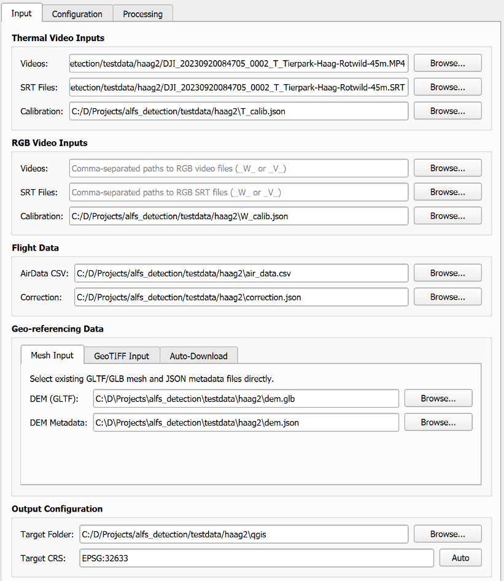

### Photo mode

Used when the drone captured a series of still images (e.g. single-shot mapping flights). Each camera requires:

| File Type        | Extension | Description                               |
|------------------|-----------|-------------------------------------------|
| Photo directory  | folder    | Directory containing the still images     |
| Calibration      | `.json`   | Camera intrinsic parameters               |

In photo mode, GPS positions are matched to images via timestamps in the AirData log and the image EXIF data. SRT files are not required.

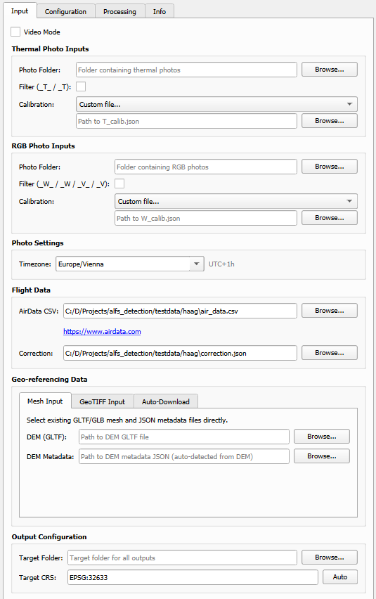

### Common inputs (both modes)

| Input         | Format            | Description |
|---------------|-------------------|-------------|
| AirData CSV   | `.csv`            | Flight log exported from AirData (GPS positions, altitude, timestamps) |
| Calibration   | `.json`           | Camera intrinsic parameters for undistortion; can be created with the [Camera Calibration Wizard](camera-calibration.md) |
| Correction    | `.json`           | Positional/rotational corrections; can be found interactively with the [Correction Wizard](correction-wizard.md) |
| DEM           | `.gltf` / `.glb`  | Digital Elevation Model + metadata JSON. Provide manually, convert a GeoTIFF, download automatically (Austria), or generate a flat surface mesh; see [DEM Import & Conversion](dem.md) |
| Target CRS    | EPSG code         | UTM-based CRS for the output (e.g. `EPSG:32633` for UTM Zone 33N). The **Auto** button derives a suitable UTM zone from the flight data |
| Target folder | folder path       | Output directory for all generated files |

## Configuration

Before starting processing, configure per-step settings in the **Configuration** tab:

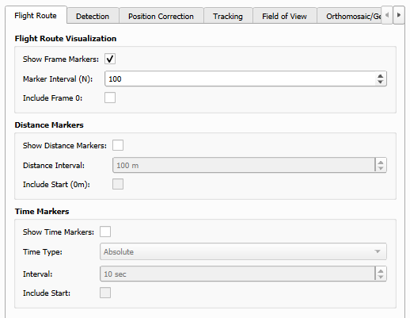

- **Extraction**: Frame skip, limit, sampling rate, and thermal visualisation (see below)
- **Detection**: Confidence threshold, thermal/RGB model paths
- **Tracking**: Backend selection, IoU threshold, interpolation, TRex tracklet import
- **SAM3**: Roboflow API key for segmentation
- **ALFS**: Resolution, tile size
- **Correction factors**: Translation and rotation offsets for geo-referencing
- **Flight route**: Frame marker interval, distance marker interval
- **Field of View**: Custom mask, simplification

### Extraction

The **Extraction** sub-tab provides fine-grained control over which frames are processed and how thermal images are rendered.

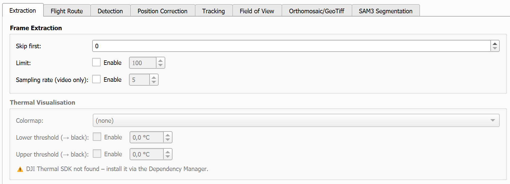

| Setting | Description |
|---------|-------------|
| **Skip first** | Skip this many frames/images at the start before processing begins. Useful for ignoring take-off frames. |
| **Limit** | Cap the total number of frames processed (enable the checkbox to activate). |
| **Sampling rate** *(video only)* | Take every N-th frame (e.g. 5 = every 5th frame). Reduces processing time for long recordings. |

**Thermal visualisation** (requires the DJI Thermal SDK, installable via the [Dependency Manager](installation.md#dependency-manager); the group is greyed out when the SDK is not detected):

| Setting | Description |
|---------|-------------|
| **Colormap** | Apply a false-colour map to the exported thermal frames (e.g. `plasma`, `inferno`, `jet`, `white-hotspot`). Choose `(none)` to keep raw 8-bit grey values. |
| **Tone mapping** | `Thresholds (lower/upper)` for a linear stretch with optional black clipping, or `Curve (custom mapping)` for a fine-granular, style curve. |
| **Lower threshold** | *(threshold mode)* Pixels below this temperature (°C) are rendered black. Enable the checkbox to activate. |
| **Upper threshold** | *(threshold mode)* Pixels above this temperature (°C) are rendered black. Enable the checkbox to activate. |
| **Curve** | *(curve mode)* Opens the curve editor: a tone curve maps a fixed temperature range to display intensity via draggable control points (left-click adds/drags, right-click removes). Because a flight's temperature bounds are usually unknown, the range can be entered manually or filled by **Auto Detect**, which scans all images in the thermal photo directory for the actual minimum/maximum (optionally ignoring the extreme 1 % to suppress dead/hot pixels). Temperatures outside the range clamp to the curve's endpoint values instead of turning black. The curve is saved with the project. |

### TRex tracklet import

If you have already tracked animals externally with [TRex](https://trex.run), the plugin can import those tracklets instead of running its own tracker. In the **Tracking** sub-tab, set the **NPZ Folder** to the directory containing the TRex `*.npz` tracklet files.

- Check **Labels already in undistorted frame space** if TRex was run on already-undistorted BAMBI frames; leave it unchecked (default) if TRex was run on the original raw video
- When an NPZ folder is set, step **4. Track Animals Or Import** imports and geo-references the TRex tracklets instead of running the configured tracking backend

## Processing steps

The steps live on two tabs, split by what they depend on:

| Tab | Steps | Depends on |
|---|---|---|
| **Pre-Processing** | P1 Extract Frames, P2 Generate Flight Route, P3 Calculate Field of View, P4 Generate ALFS, P5 Export Frames as GeoTIFF, P6 Generate Orthomosaic | the drone poses and the DEM — **no animals involved** |
| **Processing** | Three sections: *Detection and Tracking* (A1 Detect Animals with geo-referencing and perpendicular distances, A2 Track Animals Or Import), *Classification* (C1–C7), and *Segmentation* (S1 SAM3 with its geo-referencing) | the detections |

The numbering is prefixed so a bare number cannot mean two different steps.
They are *not* one sequence: only P1 is a prerequisite for the Processing tab.
Re-running detection marks the Processing steps out of date and leaves the ALFS
and orthomosaic alone.

The **→** buttons below each step load the corresponding results into QGIS as styled layers, or compute derived products. Layers are grouped under the active flight's name.

Progress, the abort button and the log sit below the tabs, so they are visible whichever tab a step was started from.

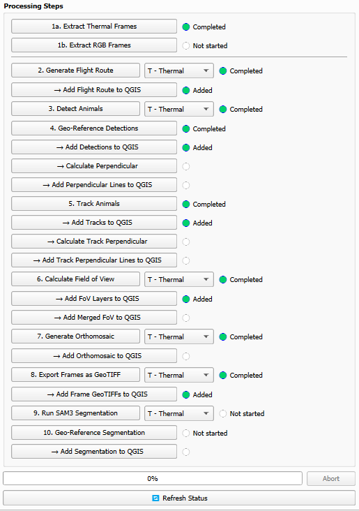

### P1. Extract Frames

Extracts, undistorts, and geo-tags frames from the input data.

- **Video mode**: Decodes frames from thermal/RGB video files; timestamps from SRT logs are matched with AirData GPS positions to compute camera poses
- **Photo mode**: Reads still images from the specified directories; image timestamps (EXIF) are matched with AirData GPS positions to compute camera poses

**Outputs:**
```
frames_t/          # Undistorted thermal frames
frames_w/          # Undistorted RGB frames
poses_t.json       # Camera pose for every thermal frame
poses_w.json       # Camera pose for every RGB frame
mask_T.png         # Undistortion mask (thermal)
mask_W.png         # Undistortion mask (RGB)
```

> **Note:** For large datasets or long videos this step may take several minutes. Progress is updated between frames.

### P2. Generate Flight Route

Builds two complementary vector layers from the mission data:

- **Flight route line**: GPS positions recorded in the AirData CSV are projected to the target UTM CRS and connected as a `LineString`. This represents the true GPS-recorded flight path.
- **Camera position points**: The position of the drone at every extracted frame (from `poses.json`) is added as a separate point layer; these are the positions at which images were actually captured.

**Outputs:**
```
flight_route_t/    # or flight_route_w/ depending on camera selection
├── flight_route.geojson       # GPS-based flight path (LineString)
└── camera_positions.geojson   # Per-frame camera positions (Points)
```

Use **→ Add Flight Route to QGIS** to load both layers with styling applied.

> **Note:** Frame extraction (P1) is optional for this step. If no `poses.json` exists yet, only the AirData-based flight route line is generated (a warning is shown), which is useful for a quick overview of the flight before running any extraction. Camera positions, frame/distance markers and image labels require P1; re-run this step after extraction to add them.

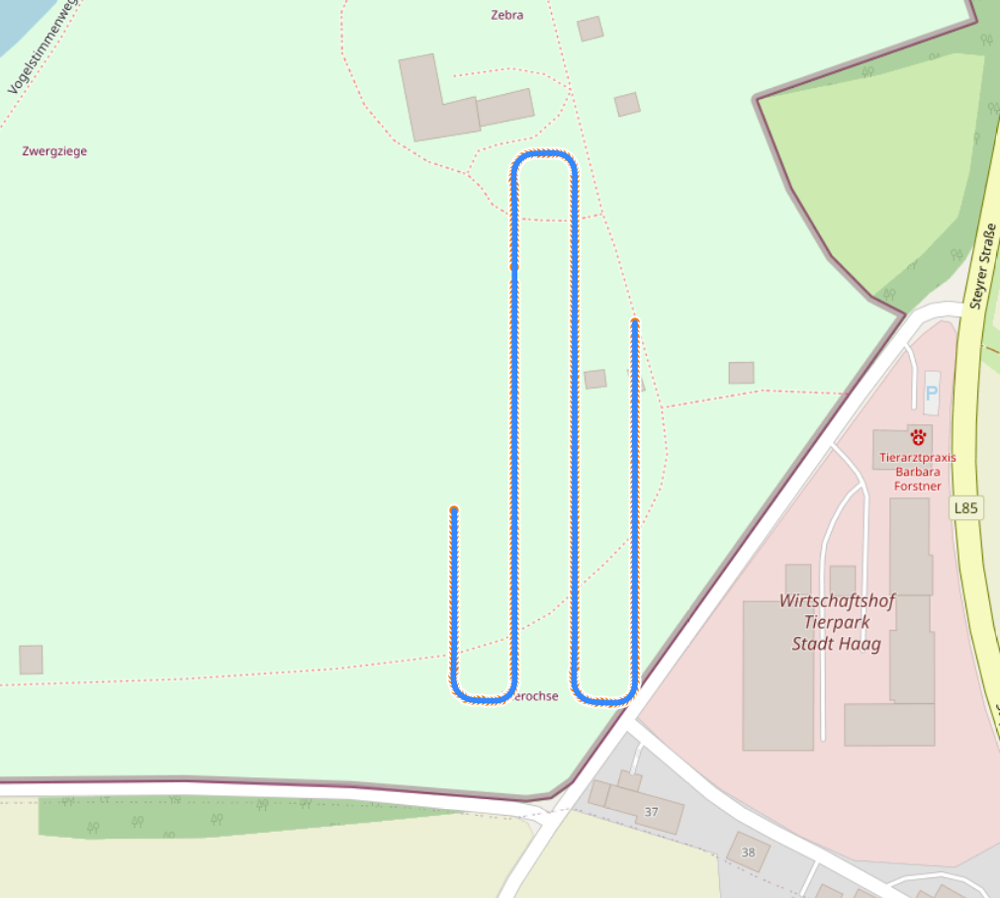

### A1. Detect Animals

Runs YOLO-based detection on all extracted frames. Separate model paths can be configured for the thermal and the RGB modality; the model matching the selected camera is used. The default wildlife detection model for each modality is downloaded automatically from HuggingFace on first use.

**Outputs:**
```
detections_t/    # or detections_w/ depending on camera selection
└── detections.txt    # Bounding box detections (frame, x1, y1, x2, y2, confidence, class)
```

Manual annotations created with the [Labelling Tool](tools.md#labelling-tool) can be added alongside the detector's output (via its **Add detections to project** button) — or can replace it entirely (via **Replace detections in project**, after confirmation) — so they flow through geo-referencing and tracking like regular detections.

Since 6.0 the two never interfere: each producer owns its own rows, so
re-running the detector leaves manual labels untouched and vice versa. Editing
a label re-uses the detections it already produced, so only the boxes that
actually moved need geo-referencing again.

#### → Geo-Reference Detections

Projects pixel-space bounding boxes to real-world UTM coordinates by ray-casting against the DEM mesh. Each detection's four corners are projected and the result is stored as a world-space bounding box.

**Outputs:**
```
georeferenced_t/    # or georeferenced_w/, follows the detection camera selection
└── georeferenced.txt    # Detections with UTM bounding box coordinates
```

Use **→ Add Detections to QGIS** to load per-frame detection layers.

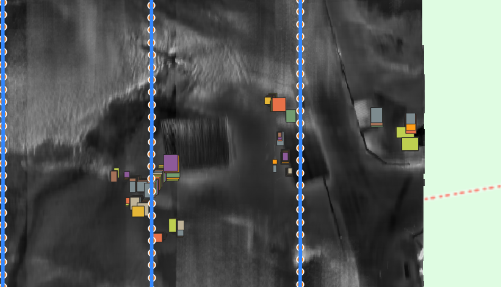

Detections whose ray never reaches the DEM — sky above the horizon, ground
beyond the DEM edge, a frame with no pose — are recorded with the reason rather
than dropped, so every detection is accounted for afterwards.

#### → Calculate Perpendicular

For each geo-referenced detection, computes the **perpendicular distance** to the flight route:

1. The 2D center of each detection's bounding box is computed
2. The nearest point on the AirData GPS `LineString` is found by projecting onto each segment
3. The Euclidean distance between the detection center and the foot point is recorded

This is particularly useful for **transect-based wildlife surveys**, where the perpendicular offset from the flight line is a key sampling variable.

**Outputs:**
```
flight_route_t/    # or flight_route_w/, uses the flight route camera selection
├── perpendicular.json             # Flat list (used by QGIS layer)
└── perpendicular_by_image.json    # Per-image keyed results
```

`perpendicular_by_image.json` structure:
```json
{
  "frame_000042.jpg": {
    "0": {
      "center": [UTM_x, UTM_y, altitude],
      "perpendicular": [foot_x, foot_y, altitude],
      "distance": 12.34
    }
  }
}
```

Use **→ Add Perpendicular Lines to QGIS** to visualize the connections as line features with a `distance_m` attribute.

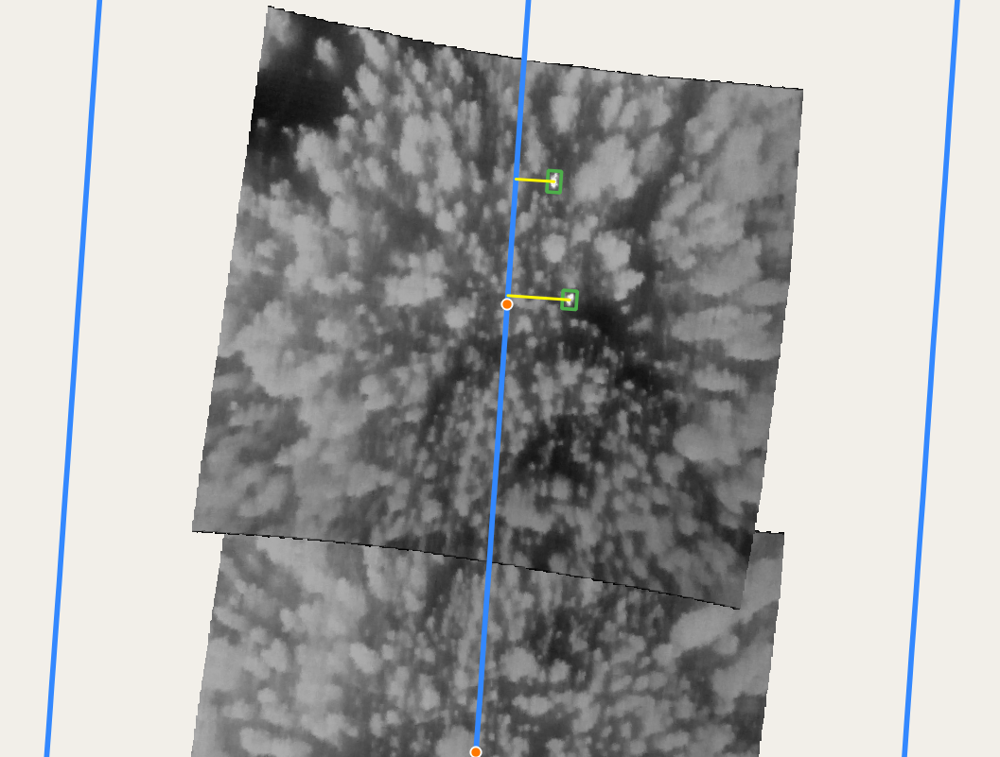

### A2. Track Animals Or Import

Associates detections across frames into continuous tracks using the selected tracking backend. If a TRex NPZ folder is configured (see [TRex tracklet import](#trex-tracklet-import)), the pre-computed TRex tracklets are imported and geo-referenced instead.

- Tracks with a single detection (no movement) are fully supported and appear as a bounding box without a movement line
- Multi-detection tracks show both the movement path and the final bounding box

**Outputs:**
```
tracks_t/    # or tracks_w/, follows the detection camera selection
├── tracks_pixel.csv    # Tracks in pixel coordinates
└── tracks.csv          # Geo-referenced tracks (UTM)
```

Use **→ Add Tracks to QGIS** to load each track as a grouped layer (movement path + final bounding box).

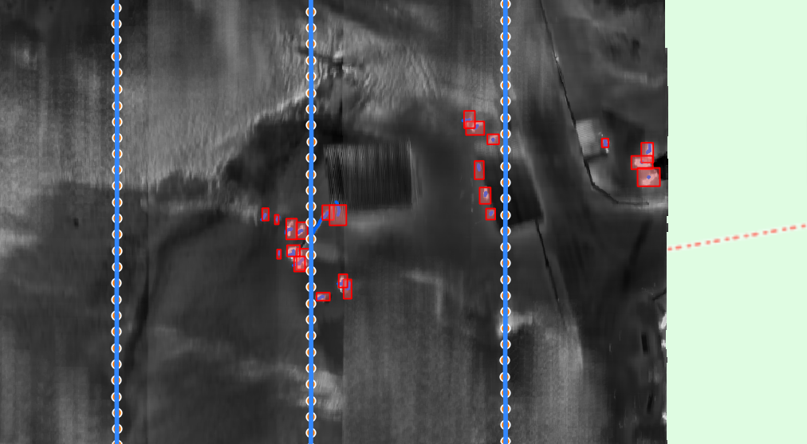

#### → Calculate Track Perpendicular

For each track, takes the **last bounding box** (the animal's final recorded position) and calculates the perpendicular distance to the flight route, using the same method as the detection perpendicular step.

**Outputs:**
```
flight_route_t/    # or flight_route_w/, uses the flight route camera selection
├── perpendicular_tracks.json             # Flat list (used by QGIS layer)
└── perpendicular_tracks_by_track.json    # Per-track keyed results
```

`perpendicular_tracks_by_track.json` structure:
```json
{
  "42": {
    "last_frame": 123,
    "last_image": "frame_000123.jpg",
    "center": [UTM_x, UTM_y, altitude],
    "perpendicular": [foot_x, foot_y, altitude],
    "distance": 35.7
  }
}
```

Use **→ Add Track Perpendicular Lines to QGIS** to visualize as line features.

### P3. Calculate Field of View

Computes the camera footprint polygon on the ground for each frame (or a subset), using the DEM for accurate terrain-following projection.

**Outputs:**
```
fov_t/    # or fov_w/ depending on camera selection
├── fov_polygons.txt      # Per-frame FoV polygon coordinates
└── merged_fov.geojson    # Union of all footprints (coverage area)
```

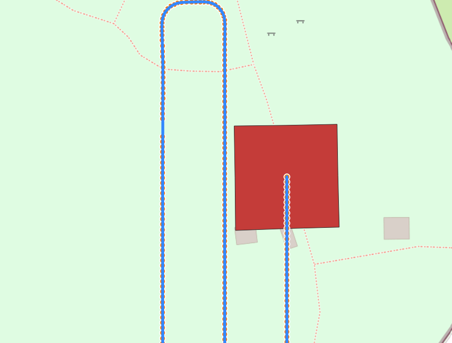

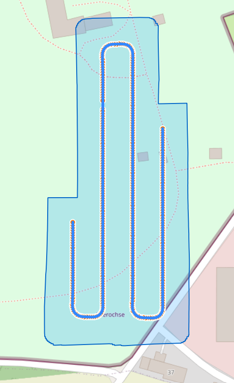

### P4. Generate ALFS

Creates a georeferenced Airborne Light Field Sampling (ALFS) by projecting all (or a subset of) frames onto the DEM surface and blending them together. Output is a Cloud-Optimized GeoTIFF.

**Outputs:**
```
alfs_t/    # or alfs_w/ depending on camera selection
└── alfs.tif    # Georeferenced mosaic (COG GeoTIFF)
```

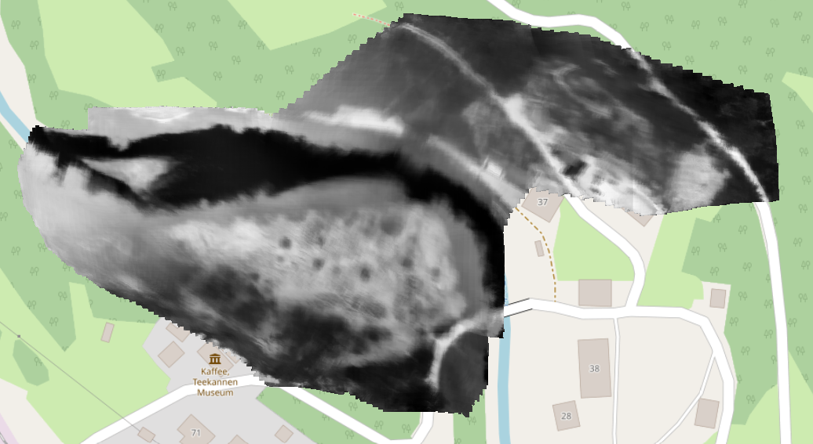

### P5. Export Frames as GeoTIFF

Exports individual frames as georeferenced GeoTIFFs, suitable for import into GIS tools or for detailed per-frame analysis.

**Outputs:**
```
geotiffs_t/    # or geotiffs_w/ depending on camera selection
├── frame_000000.tiff
└── ...
```

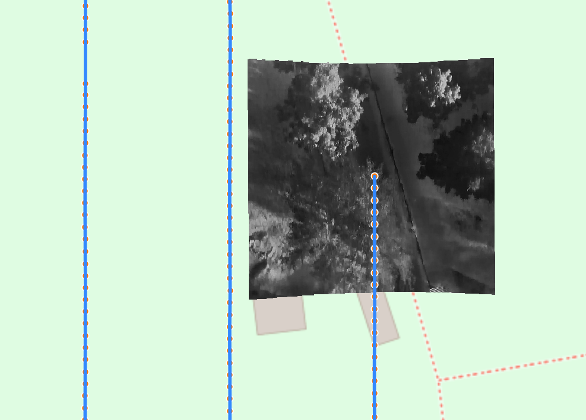

### P6. Generate Orthomosaic

Builds a **true orthomosaic** by mosaicking the individually orthorectified frame GeoTIFFs from P5 into a single georeferenced raster. Unlike the ALFS product (an integral light-field image), this merges the exported GeoTIFFs with `rasterio`, so P5 must be run first for the selected camera.

Like the other steps you can use **all** exported GeoTIFFs or restrict to a **frame-index range**, choose the **camera** (Thermal / RGB), and pick the **merge mode** that resolves overlapping pixels:

- **First**: the first frame covering a pixel wins (default)
- **Last**: the last frame covering a pixel wins
- **Min**: the darkest overlapping value wins
- **Max**: the brightest overlapping value wins
- **Average**: the mean of all overlapping frames (smooths seams; slower, two-pass)

**Outputs:**
```
orthomosaic_t/    # or orthomosaic_w/ depending on camera selection
└── orthomosaic.tif    # Merged georeferenced orthomosaic (LZW GeoTIFF with overviews)
```

### Classification

Works out **what** each tracked animal is: whether a frame shows it clearly, what species it is, its sex, and whether it is a juvenile. Implements the pipeline of *When One Modality Is Not Enough: Multimodal Sex and Life-Stage Classification of Red Deer from Aerial RGB–Thermal Video*.

> **Tracks you annotated in the labelling tool are never changed by these steps.** A hand annotation outranks a model: the classifiers fill in what is missing and leave your own work alone.

The reason this is worth doing in two sensors rather than one is that they fail in opposite conditions. In colour a deer under canopy blends into the ground; in thermal it is an unmistakable bright blob but the fur colour is gone, and antlers only show while they are still growing and warm. Which sensor carries the sex cue therefore changes with the season — which is why the *matched* option, reading both at once, is the default.

> **Requires a Hugging Face token.** The DINOv3 model these classifiers read is *gated*: request access at [huggingface.co/facebook/dinov3-vith16plus-pretrain-lvd1689m](https://huggingface.co/facebook/dinov3-vith16plus-pretrain-lvd1689m), then paste a read token into **Configuration → Classification** and press **Check access**. See [Installation](installation.md#classification).

#### C1. Match RGB ↔ Thermal Tracks

Decides which thermal track and which RGB track are the same animal, by registering the two views onto each other and comparing where the boxes sit. Needs both cameras tracked; there is no camera selector, because the step is inherently about the pair.

Confirmation is what keeps a census honest. An animal both cameras saw is a real animal; a track only one camera saw is either an animal the other sensor cannot make out, or noise. In the paper's four test flights, of 34 tracks without a partner only *one* was a real animal — admitting them all would have added six individuals that did not exist.

The run log reports how many pairs were confirmed out of how many raw tracks. If nothing matches, it names which gate rejected everything and how far the closest candidate was, so you can tell "there were no animals" from "the gate is wrong for this resolution".

**→ Add Matched Pairs to QGIS** draws a line between each pair's positions, attributed with the shared frame count and median distance — the quickest way to see whether the gate is set sensibly.

**Outputs:**
```
matches.gpkg    # beside project.gpkg: a match belongs to neither camera
```

#### C2. Compute DINOv3 Embeddings

Describes every tracked animal's crop as a feature vector, once, so all three classifiers can reuse it. This is the expensive step — the model is large, and on CPU it takes minutes per hundred crops.

Vectors are written beside the frames, one file per frame, so they are reusable outside the plugin. A re-run only embeds what is missing: an interrupted run resumes rather than starting again, and changing the crop settings starts a new set without discarding the old one.

**Outputs:**
```
embeddings_t/            # or embeddings_w/
└── non_geo/             # or geo_1k/ geo_2k/, per the chosen projection
    └── frame_000123.npz # one array per detection, named det_<id>
bambi_t/classification.gpkg   # which detections are embedded, and by which run
```

#### C3–C5. Occlusion, Species and Sex Classification

One step each, run in that order, because each depends on the one before:

1. **Occlusion**, per frame, labels a crop *clear* or *occluded*. It is a quality filter, not a verdict about the animal, so it produces no per-animal answer — and it is **optional**.
2. **Species** votes across the frames that are worth trusting, and its majority fixes what the animal is.
3. **Sex** reuses *exactly those frames*, and picks its model from the species just assigned.

Voting is what makes a noisy per-frame call safe. An antler only resolves from some angles, so many frames of a true male look female; the majority still recovers him. The margin behind every call is kept — "male, 106 of 115 frames" is what lets you judge a borderline animal — and you can re-vote at a different quorum without re-running anything.

An animal the classifier cannot call is **left unknown, never discarded**: it keeps its place in the census with the attribute blank.

**Frames used** decides what may vote. *Visible frames only* uses the occlusion classifier when it ran, otherwise occlusion values you annotated by hand, and otherwise every frame — the run log always says which of the three it used.

**C7. Apply Classifications to Tracks and Detections** copies the answers onto the animals themselves, which is what makes them visible to the exports, the map layers, the survey analytics and the labelling tool. It runs automatically unless switched off, and is safe to repeat.

#### C6. Age Classification

Flags juveniles by body size — the **fallback** where no classifier called the animal.

Life stage comes from whatever you chose for that species. Under the life-stage classifier's **Species…** button each species is set to **Size-based**, a model, or **Off** — one decision in one place, rather than a model choice plus a switch somewhere else. Size-based is the default, because no life-stage model has been published yet; a species set to a model is called by it in C3 and left alone here, and one set to Off is not called at all.

Needs no models — only tracks, and geo-referencing if the metric areas are to be used.

A juvenile cannot be told from an adult female by appearance at survey resolution, which is exactly why the sex classifier's second class is *female/juvenile*. Size settles it: a juvenile sits far below its cohort **and** has a clear gap to the next animal up. Both conditions are required, because in any herd someone is smallest and that alone is not evidence.

Sizes are only ever compared **within one flight** — how tightly boxes fit varies between recordings, enough that the paper's own juvenile from one flight lands inside another flight's adult range. There is deliberately no absolute threshold.

Areas come from the **geo-referenced** boxes where geo-referencing has run, which makes them metric; otherwise from the camera-frame boxes, which still work because the comparison never leaves the flight. Which was used is recorded with every verdict, so metric and pixel figures are never mixed. Animals a classifier already called still count towards the cohort statistics — excluding them would shift everyone else's score — they simply do not take a verdict from it.

On a flight with only a handful of animals the test declines to call one, because the candidate sits in the lower half of the distribution and so widens the very spread it is measured against. The log says so rather than reporting a bare "no juvenile found": a cautious answer and an empty one look identical otherwise.

**Outputs:**
```
bambi_t/classification.gpkg
├── frame_predictions    # per crop: label, probability, model
└── track_predictions    # per animal: the call, and the vote behind it
```

### S1. Run SAM3 Segmentation

Segments individual detected objects from aerial images using Roboflow's SAM3 API. Recommended for RGB imagery.

> **Requires a Roboflow API key**: enter it in the **Configuration → SAM3** tab (Roboflow API Configuration group). The key is masked by default; use the "Show API key" checkbox to verify it.

**Outputs:**
```
segmentation_t/    # or segmentation_w/ depending on camera selection
└── segmentation_pixel.json    # Pixel-space segmentation masks
```

#### → Geo-Reference Segmentation

Projects SAM3 pixel-space segmentation masks to world coordinates using the DEM.

**Outputs:**
```
segmentation_t/    # or segmentation_w/ depending on camera selection
└── segmentation_georef.json    # UTM-coordinate segmentation polygons
```

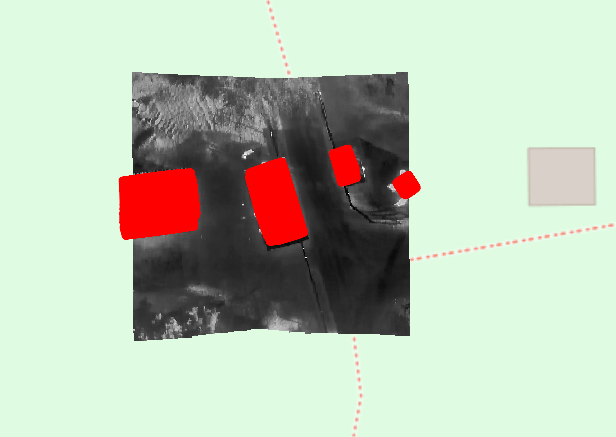

## Survey analytics

The **Survey Analytics** tab (next to *Processing*) turns geo-referenced detections, tracks, or exported frames into population-level products. The point-based tools (density heatmap, distance sampling) let you pick the **source**: *Detections* uses every geo-referenced bounding box, while *Tracks* uses one representative point per track (so an animal followed across many frames is counted once); their camera (thermal/RGB) follows the existing Detection / Tracking camera selectors. The coverage map instead combines the exported frame GeoTIFFs and has its own camera selector. Results are written to a new `analytics_t/` or `analytics_w/` folder, and the run log for these steps appears below the tabs.

Each result records **what it counted** — the tracking run used, whether manual
tracks were included, the species filter, and how many detections labelled
`not-an-animal` were excluded — so a figure can be traced back to the rows
behind it. Two rules apply throughout: one tracker run contributes (built-in,
BoxMOT and TRex describe the same animals, so pooling two would double-count),
and manual tracks are *added* to it, since labels are usually animals the
detector missed. A label created with *Import as label track* replaces the
tracker track it came from instead of adding to it. See
[Results, Flights and Export](results-and-export.md#what-the-analytics-counted).

**Analysing several flights together.** *Distance sampling* and *Population estimation* each carry a **Projects** selector: add one or more BAMBI projects and/or keep **Add current project** ticked, and the analysis runs on every project and combines the results into a single estimate (distance sampling pools the perpendicular distances and sums the flight-route effort *L*; population estimation pools all the transects into one count/area sample set). Leaving the list empty with only *Add current project* ticked reproduces the single-project behaviour. Before running, each project is checked for its required files — if anything is missing the run is aborted and a message names what is missing in which project(s). The combined result is written to the **active project's** `analytics_*` folder, while each pooled project keeps its own per-transect CSV/GeoJSON in its own folder.

**+ Add Flight…** is the shortcut for flights this QGIS project already holds:
the target folder and the DEM are taken from the flight itself, so there is
nothing to look up. Pointing at unrelated target folders still works exactly as
before.

For distance sampling an added project is just a target folder. For population estimation the transects must be georeferenced with the right DEM origin, so its **+ Add Project…** button opens a small dialog with **two pickers** — the project's target folder and its **`dem.json`** (DEM metadata JSON). The active project reuses the DEM configured for the active flight; every *added* project supplies its own `dem.json`, and the results dialog shows each project's DEM-origin source (`config` for the active project, `provided` for added ones).

### Density heatmap

Generates a **kernel-density estimate raster** of animal locations. Points are binned to a grid and smoothed with a Gaussian kernel; each output pixel is the estimated density in **animals per hectare**.

| Setting | Description |
|---------|-------------|
| **Source** | Detections (every box) or Tracks (one point per track) |
| **Cell (m)** | Output raster cell size in metres (default 5 m) |
| **Bandwidth (m)** | Gaussian smoothing radius in metres (default 25 m) — larger values give smoother, broader hotspots |

**Outputs:**
```
analytics_t/    # or analytics_w/
├── density_detections.tif    # or density_tracks.tif — float32 GeoTIFF (points/hectare)
└── density_detections.json   # stats: peak/mean density, point count, parameters
```

Use **→ Add Density Heatmap to QGIS** to load the raster with a blue→red colour ramp scaled to the data. Empty (no-signal) cells are stored as nodata so the surround renders transparent.

### Distance sampling

Estimates **density and abundance with 95% confidence intervals** using conventional line-transect distance sampling. It reuses the perpendicular distances already produced by **Calculate Perpendicular** (detections) or **Calculate Track Perpendicular** (tracks), so run one of those first.

The tool fits both a **half-normal** and a **hazard-rate** detection function by maximum likelihood, selects the better fit by **AIC**, and computes the effective strip width (ESW), average detection probability, density (per km²) and abundance for the covered strip. Uncertainty combines a Poisson encounter-rate term with the detection-function variance via the delta method, reported as a lognormal confidence interval.

| Setting | Description |
|---------|-------------|
| **Source** | Detections or Tracks (tracks — one observation per animal — are usually preferred) |
| **Truncation (m)** | Discard observations beyond this perpendicular distance. `0` = automatic (95th percentile) |

On completion a results dialog summarises n, transect length, truncation, the selected model, ESW, detection probability, density and abundance with CIs, plus the model-comparison (AIC) table.

**Outputs:**
```
analytics_t/    # or analytics_w/
└── distance_sampling_detections.json   # or distance_sampling_tracks.json
```

The JSON also stores the fitted detection-function curve and the distance histogram for external plotting. Abundance is reported for the covered strip area (2·w·L); multiply the density estimate by your study-area size for a study-area abundance.

### Coverage map

Combines the exported per-frame GeoTIFFs on the same grid as the **Orthomosaic**, but instead of merging image content it counts, per output pixel, how many frames contain valid (non-nodata) data at that position. The result is a single-band raster where `1` means the ground was imaged once, `N` means it was seen in `N` overlapping frames, and nodata (`0`) means it was never covered — a map of survey effort/overlap. Run **Export Frames as GeoTIFF** for the chosen camera first.

| Setting | Description |
|---------|-------------|
| **Camera** | Thermal or RGB — which exported frame GeoTIFFs to combine |
| **Cell (m)** | Output raster cell size in metres. `0` = native resolution of the exported GeoTIFFs (larger output) |

**Outputs:**
```
analytics_t/    # or analytics_w/
├── coverage_map.tif    # uint16 GeoTIFF — overlapping frame count per pixel
└── coverage_map.json   # stats: frame count, max/mean overlap, covered & multi-covered area (ha)
```

Use **→ Add Coverage Map to QGIS** to load the raster with a graduated colour ramp scaled to the data. Uncovered cells are stored as nodata so the surround renders transparent.

## Input file formats

### Calibration JSON

```json
{
    "mtx": [[fx, 0, cx], [0, fy, cy], [0, 0, 1]],
    "dist": [k1, k2, p1, p2, k3]
}
```

### DEM metadata JSON

```json
{
    "origin": [UTM_x, UTM_y, UTM_z],
    "origin_wgs84": {
        "latitude": 47.xxx,
        "longitude": 14.xxx,
        "altitude": 500.0
    }
}
```

### Correction JSON (optional)

```json
{
    "translation": {"x": 0.0, "y": 0.0, "z": 0.0},
    "rotation": {"x": 0.0, "y": 0.0, "z": 0.0},
    "additional": [
        {
            "start": 10,
            "end": 100,
            "translation": {"x": 0.0, "y": 0.0, "z": 0.0},
            "rotation": {"x": 0.0, "y": 0.0, "z": 0.0}
        }
    ]
}
```

## Output structure

Each stage writes to a camera-specific subfolder (`_t` for thermal, `_w` for RGB), so thermal and RGB results coexist without overwriting each other.

Since 6.0 the results themselves live in GeoPackages, with the text files below
written alongside for compatibility — see
[Results, Flights and Export](results-and-export.md):

```
target_folder/
├── project.gpkg                             # Species, enums, custom fields,
│                                            # configuration, step status
├── bambi_t/                                 # Thermal results, one file per step
│   ├── detections.gpkg
│   ├── georeferenced.gpkg                   # …plus why a detection was dropped
│   ├── tracks.gpkg                          # Track membership by detection id
│   ├── fov.gpkg
│   ├── labels.gpkg
│   └── segmentation.gpkg
├── bambi_w/                                 # RGB, same set
│   └── ...
```

The text outputs below are still produced, and can be switched off under
**Output Configuration** once nothing of yours reads them:

```
target_folder/
├── frames_t/                                # Extracted/undistorted thermal frames
│   ├── frame_000000.jpg
│   └── ...
├── frames_w/                                # Extracted/undistorted RGB frames
│   └── ...
├── poses_t.json                             # Camera pose per thermal frame
├── poses_w.json                             # Camera pose per RGB frame
├── mask_T.png                               # Thermal undistortion mask
├── mask_W.png                               # RGB undistortion mask
├── flight_route_t/                          # Flight route (thermal camera poses)
│   ├── flight_route.geojson                 # AirData GPS flight path (LineString)
│   ├── camera_positions.geojson             # Per-frame camera positions (Points)
│   ├── perpendicular.json                   # Detection perpendicular distances (flat)
│   ├── perpendicular_by_image.json          # Detection perpendicular distances (by image)
│   ├── perpendicular_tracks.json            # Track perpendicular distances (flat)
│   └── perpendicular_tracks_by_track.json   # Track perpendicular distances (by track)
├── flight_route_w/                          # Flight route (RGB camera poses)
│   └── ...
├── detections_t/                            # Detections on thermal frames
│   └── detections.txt                       # Raw YOLO detections
├── detections_w/
│   └── detections.txt
├── georeferenced_t/                         # Geo-referenced thermal detections
│   └── georeferenced.txt                    # Detections with UTM bounding box coordinates
├── georeferenced_w/
│   └── georeferenced.txt
├── tracks_t/                                # Tracks from thermal detections
│   ├── tracks_pixel.csv                     # Tracks in pixel coordinates
│   └── tracks.csv                           # Geo-referenced tracks (UTM)
├── tracks_w/
│   └── ...
├── labels_t/                                # Manual labels (Labelling Tool, thermal)
│   ├── labels.json                          # Key-frame label tracks (source of truth)
│   └── labels.csv                           # Per-frame interpolated label export
├── labels_w/
│   └── ...
├── fov_t/                                   # Field of View (thermal camera)
│   ├── fov_polygons.txt                     # Per-frame FoV polygon coordinates
│   └── merged_fov.geojson                   # Combined coverage area
├── fov_w/
│   └── ...
├── alfs_t/                                  # ALFS from thermal frames
│   └── alfs.tif                             # Georeferenced mosaic (COG GeoTIFF)
├── alfs_w/
│   └── alfs.tif
├── geotiffs_t/                              # GeoTIFFs from thermal frames
│   ├── frame_000000.tiff
│   └── ...
├── geotiffs_w/
│   └── ...
├── orthomosaic_t/                           # Orthomosaic merged from thermal GeoTIFFs
│   └── orthomosaic.tif
├── orthomosaic_w/
│   └── orthomosaic.tif
├── segmentation_t/                          # SAM3 segmentation on thermal frames
│   ├── segmentation_pixel.json              # Pixel-space segmentation masks
│   └── segmentation_georef.json             # Geo-referenced segmentation polygons
├── segmentation_w/
│   └── ...
├── analytics_t/                             # Survey analytics (thermal camera)
│   ├── density_detections.tif              # Density heatmap raster (points/hectare)
│   ├── density_detections.json             # Density heatmap stats
│   ├── distance_sampling_detections.json   # Distance-sampling density/abundance estimate
│   ├── coverage_map.tif                    # Coverage map raster (overlapping frame count)
│   └── coverage_map.json                   # Coverage map stats
└── analytics_w/
    └── ...
```

> **Note:** Only the subfolders for camera/stage combinations you actually run will be created. Running a stage for only one camera leaves the other subfolder absent.

Detection and Re-ID models are stored globally in the QGIS profile directory and shared across all projects:

```
%APPDATA%\QGIS\QGIS3\profiles\default\bambi_deps\models\
├── thermal_animal_detector.pt               # YOLO detection model (thermal)
├── rgb_animal_detector.pt                   # YOLO detection model (RGB)
├── osnet_x0_5_bambi_thermal_omni.pt         # BAMBI Re-ID model
└── osnet_x0_25_msmt17.pt                    # BoxMOT default Re-ID model
```
