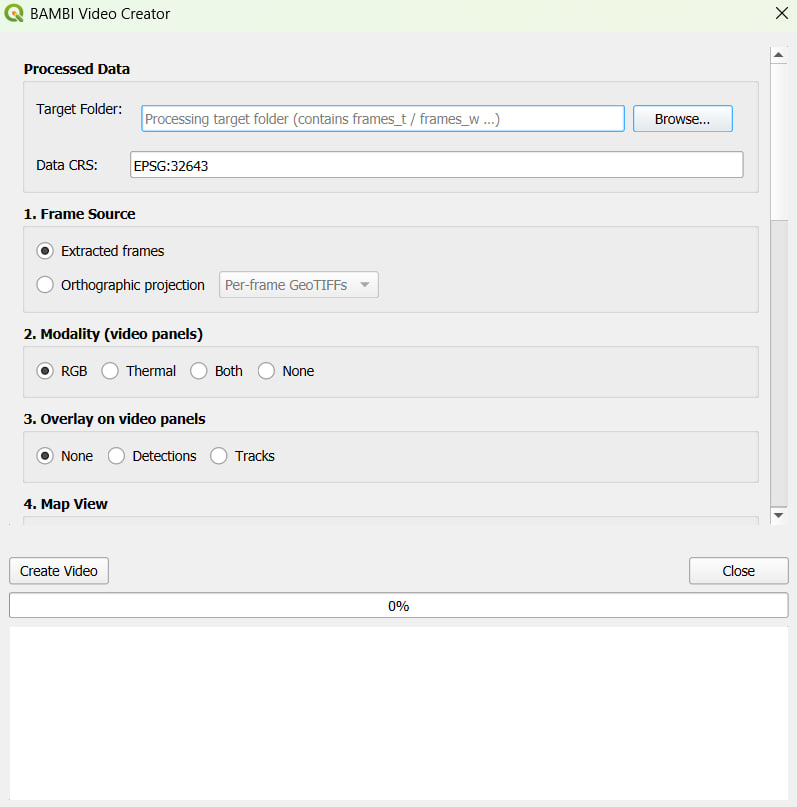
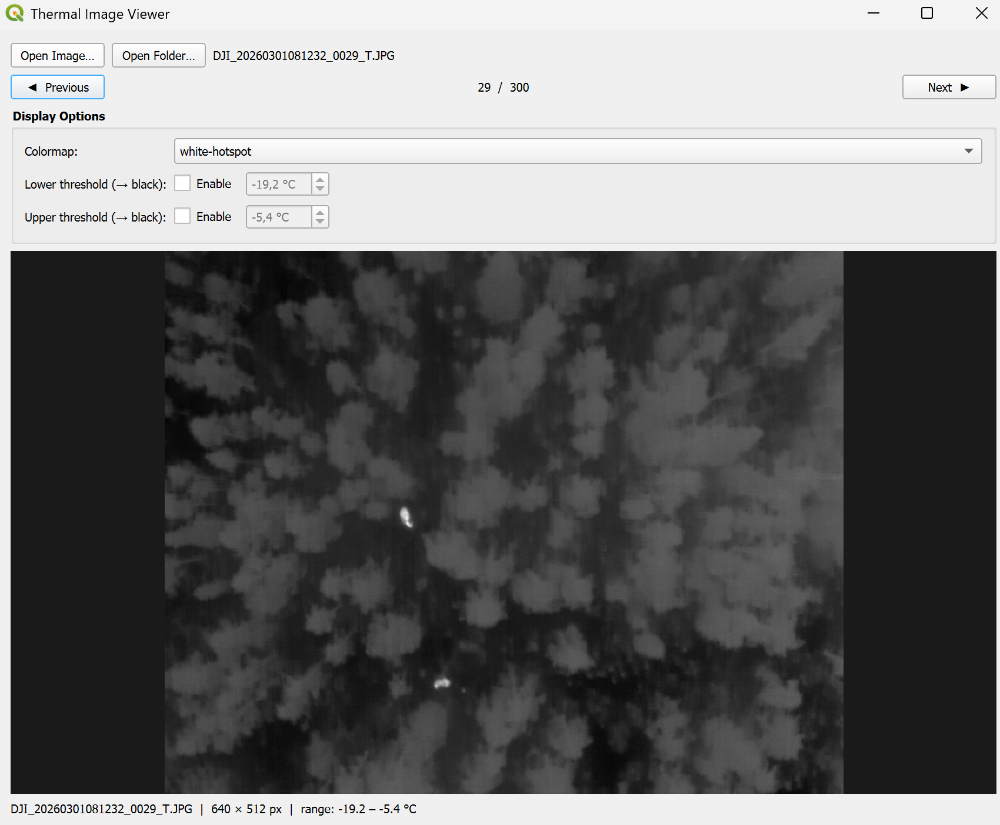
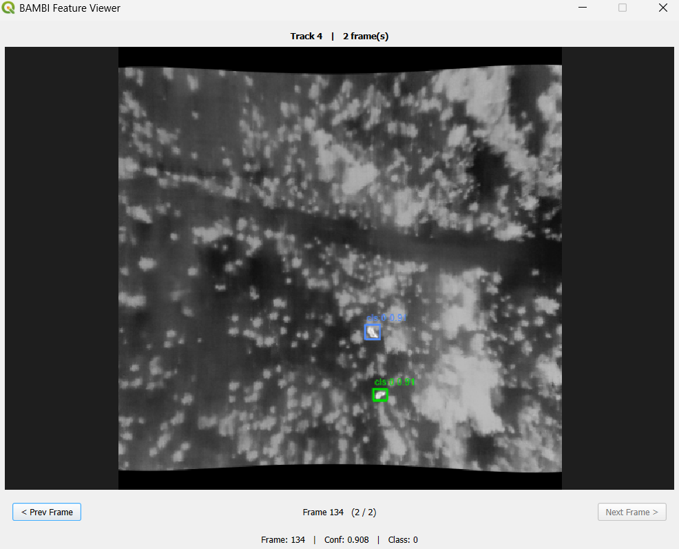
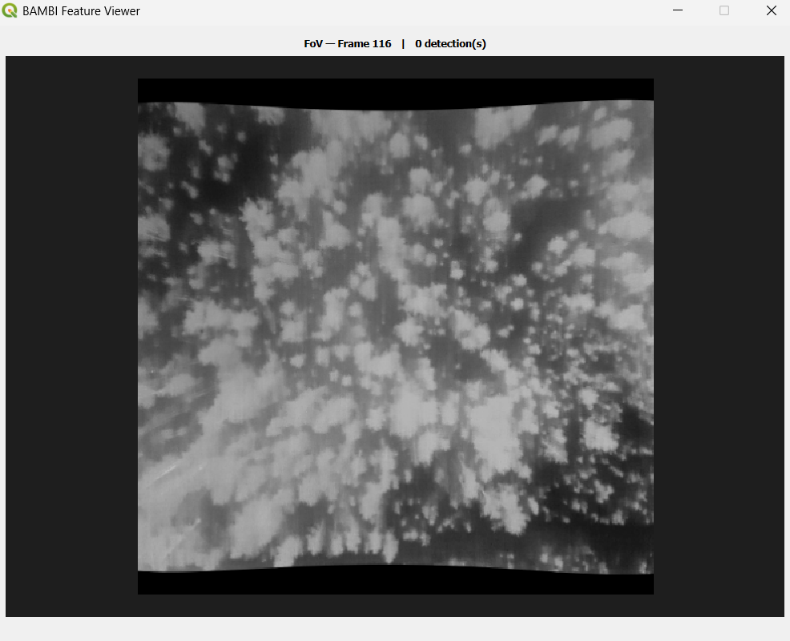
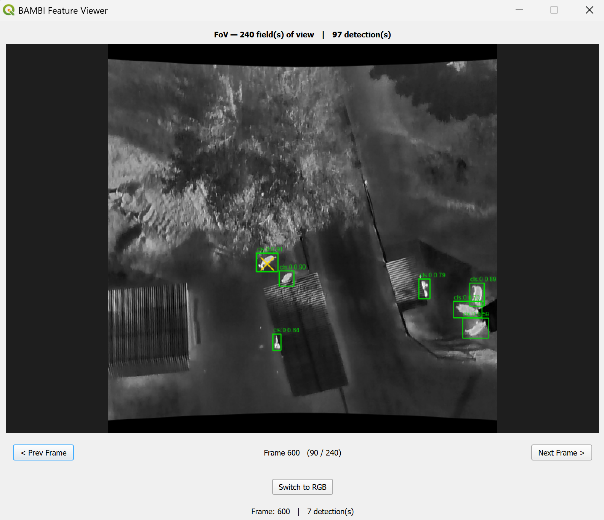

# Tools

Besides the main processing pipeline, the plugin ships several companion tools available from the BAMBI toolbar and the plugin menu.

- [Video Creator](#video-creator)
- [Thermal Image Viewer](#thermal-image-viewer)
- [Interactive selection tools](#interactive-selection-tools)

## Video Creator

The Video Creator turns processed BAMBI results into a shareable MP4 video. Open it via the **Video Creator** toolbar button or the plugin menu.

Point it at a processing **target folder** (the one containing `frames_t/` / `frames_w/`) and compose a video from up to three side-by-side panels plus an info bar:

| Section | Options |
|---------|---------|
| **Frame source** | Extracted frames, or the orthographic projection (per-frame GeoTIFFs or the ALFS mosaic) |
| **Modality** | RGB, Thermal, Both (two video panels), or None (map only) |
| **Overlay** | None, detections, or tracks drawn onto the video panels |
| **Map view** | A panel rendered live from the QGIS project — flight path, current field of view, detections, tracks, perpendicular distances, merged FoV as background, a frame-by-frame accumulating FoV (area monitored so far), and an optional satellite/OSM background (needs internet) |
| **Info panel** | Bottom bar showing the current frame number, detection/track counts for the current frame, and monitored area (observed / total) |
| **Output** | MP4 file path, frames per second, panel height in pixels, and all frames or a frame range |

At least one video modality *or* the map panel is required. Rendering runs on the GUI thread (QGIS map rendering must happen there) but keeps the UI responsive; a Cancel button aborts cleanly.

## Thermal Image Viewer

The Thermal Image Viewer is a standalone non-modal dialog for inspecting individual DJI radiometric thermal images. Open it via the **Thermal Image Viewer** toolbar button or the plugin menu.

> **Requires DJI Thermal SDK** — install it via the [Dependency Manager](installation.md#dependency-manager).

Key features:

- Load any DJI radiometric thermal JPEG or TIFF directly
- Choose from multiple **colormaps** (`white-hotspot`, `black-hotspot`, `plasma`, `inferno`, `magma`, `viridis`, `jet`)
- Set optional **lower and upper temperature thresholds** (°C) that clip the display range, making it easier to isolate warm or cold targets
- Pixel temperature readout on hover

## Interactive selection tools

Three map-canvas click tools are available from the BAMBI toolbar to inspect layers that have already been loaded into QGIS.

### Detection / track selection

Click the **Select Detection or Track** tool in the toolbar, then click anywhere on the map canvas to highlight the detection or track bounding box nearest to the clicked point.

- Works on any layer that was added via **→ Add Detections to QGIS** or **→ Add Tracks to QGIS**
- The clicked feature is selected in the layer and its attributes are shown in the inspector panel
- If no detection or track layers are present in the QGIS layer hierarchy, a warning dialog is shown

### Field-of-view selection

Click the **Select Field of View** tool in the toolbar, then click on the canvas to select the FoV(s) that contain the clicked point.

- Works on any layer that was added via **→ Add FoV Layers to QGIS** (not the merged FoV!)
- If no Field of View layers are present, a warning dialog is shown

There are two versions of the FoV tool:

1. A fast version that just opens the related FoVs
2. A **geo-referenced** version that also geo-references your click and shows it as a yellow cross. This requires loading the digital elevation model, which takes some time, and the result depends heavily on your calibration parameters and correction factors.

